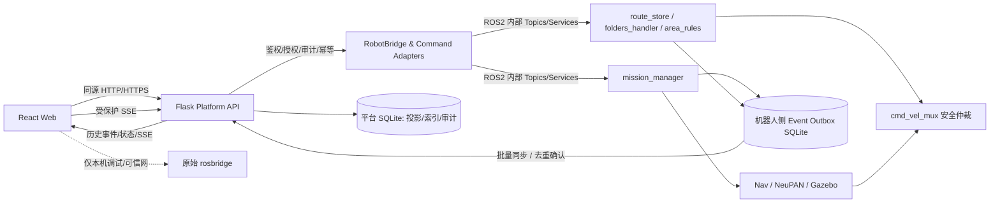

# Alpha 项目 S0 完善——Codex 工程实施交接说明

> **用途**：把此文件放进本地 Alpha 仓库（建议 `docs/s0/CODEX_HANDOFF.md`），在仓库根目录将全文交给 Codex，作为可以直接修改本地源码、提交测试与文档的实施任务书。  
> **范围**：仅 S0「基础架构、数据模型和机器人通信」，包含 S0-01～S0-15 的缺口修补、必要的前端/后端/ROS2 联动与仿真测试。**不提前实施 S1/S2 的完整 AI 巡检业务或实机驱动**。  
> **核对基线**：GitHub `YansenSong/Alpha` `main` 在 2026-10-09 核对的提交 `3dba16ea67b390bb73ac94afe70a3475a1048880`。这是静态检查基线，**不是对用户本地工作区的假设**。  
> **项目阶段**：**Gazebo 仿真优先，未来原样复用平台协议并替换实机适配器**。  
> **执行主体**：Codex 在**用户本地仓库**操作；用户的本地路径、ROS 环境、未提交修改、可用依赖以实际探测为准。  
> **完成证据**：代码 diff、自动化测试输出、ROS 图核验、手工 Gazebo 用例及 `docs/s0/S0_IMPLEMENTATION_REPORT.md`。仅提交文档/接口定义但未接入前后端，不视为完成。

---

## 0. 给 Codex 的直接执行指令（请先读）

你是 Alpha 仓库的工程实施者，不是纯审稿人。**请在当前本地仓库实际编辑、添加和测试代码**，按本文逐项完善 S0。执行时遵守以下顺序：

1. **先审计本地工作区**：记录 `git status --short`、`git branch --show-current`、`git rev-parse HEAD`、ROS 发行版与可用工具；检索现有实现再决定改动。不得假定本地代码与上述 GitHub 提交完全一致。发现本地有更新实现，应复用而不是倒退。
2. **不要破坏用户工作**：不得 `git reset --hard`、不得清除未追踪文件、不得自动覆盖本地未提交改动，不使用破坏性清理命令；避免格式化全仓造成噪音 diff。遇到文件冲突时通过非破坏性增量编辑完成。
3. **先列一份本地差异/任务矩阵**，但不以等待人为确认作为默认停止理由。按 W0～W7 分阶段落地、逐阶段回归，具备条件时直接继续下一阶段。
4. **所有控制能力同时检查前端、Flask、ROS2 实际执行节点**：禁止只改 UI 按钮或只增一个 API 端点就标记完成。要求“UI → HTTP/受保护实时通道 → 网关/适配器 → ROS2 → 端侧确认 → 状态/事件回传 → UI”可追踪。
5. **优先修改已有模块**，除非确实需要独立模块。保留当前 `mission_manager` 作为唯一任务执行器、`route_store`/`folders_handler` 的既有地图管理能力、`area_rules` 的区域存储/安全输出与现有 Flask 身份体系。禁止再建第二套任务执行状态机。
6. **模拟数据必须标记 `simulation` 或 `simulated`**，缺失的数据展示 `UNKNOWN/unavailable/stale`，不得用固定绿色、虚构 SOC、虚构 5G 信号、虚构定位质量或假的“命令已完成”蒙混。
7. **安全首先在机器人侧生效**：Web 权限仅是第一层；软件停车、区域规则、运动超时、任务 hold 和本地底盘仲裁不得被 HTTP 或 ROSBridge 绕过。**软件停车不等于物理硬急停**。
8. **代码与契约双向更新**：实现接口后同步更新接口表、Schema、前端客户端、测试和 README。旧接口如暂时保留，应在文档中记录兼容期限与部署约束。
9. 若本机缺 ROS/Gazebo/物理设备，先执行能够执行的静态检查、前端测试、纯 Python 单测/FakeBridge 集成测。将被阻塞的运行态用例列成操作脚本，不允许声称已通过。
10. 完成时交付：`docs/s0/S0_IMPLEMENTATION_REPORT.md`（逐项状态、代码证据、测试命令及输出摘要、阻塞项）、契约与部署文档、可复跑测试、变更文件清单和剩余实机迁移工作。**不要只交付计划**。

### 0.1 不在范围内

- 不训练/集成火焰、烟雾、积水、安全帽、人脸、货位等 AI 识别模型；但必须为其将来的结果/告警/证据预留可验证的标准模型。
- 不构建完整 S1 巡检资产业务页面，不增加多机器人集群、云端身份源 OIDC、企业微信集成或 3D 点云实时大屏。
- 不把真实硬件 BMS、5G/Wi-Fi 模组、控制器、物理 E-stop 当作本期可验收；本期只要求**契约、适配边界、缺失值语义和模拟测试**。
- 不为 S0 另起 Qt 桌面版；沿用 React Web + Flask + ROS2。Android/鸿蒙本体屏属于后续 S2，S0 只预留可重用接口。

### 0.2 基本完成标准

**S0 完成必须同时满足**：统一且受控的远端写入口；机器人任务/地图/区域基础协议与 IDs 可追踪；端侧实际检查危险动作许可；状态新鲜度与掉线可见；机器人端离线重要事件可补传且去重；平台历史事件与前端一致；开发环境可重建；测试证据可查询。**“HTTP 202 Accepted”仅是受理，不代表任务执行成功。**

---

## 1. 当前源码事实与入口（执行前复查）

| 模块 | 现有文件/入口（相对于 Alpha 根目录） | 已具备的能力 | S0 工作重点 |
|---|---|---|---|
| 前端框架 | `third_party/RobotPilot/web/src/app/App.jsx` | React 上下文、共享 ROSLIB 连接、断线重连、`open/local` 认证感知 | 统一平台数据/连接状态、保护模式下禁止旧写流 |
| 前端路由 | `third_party/RobotPilot/web/src/pages/registry.js` | Map、Route、Maps、Info、Health、Events、Logs、BMS 等页 | 不做无关 UI 重构，接通新数据源 |
| 前端 HTTP | `third_party/RobotPilot/web/src/shared/api/apiFetch.js` | 请求 ID、Cookie、CSRF、错误处理 | 统一响应/错误契约、幂等命令客户端封装 |
| 前端任务 | `third_party/RobotPilot/web/src/shared/missions/taskApi.js`、`components/MissionClient.jsx`、`shared/missions/missionClient.js` | 一次性任务 API；旧 ROS topic 命令仍并存 | 统一写命令，移除远端控制绕路 |
| 前端地图 | `third_party/RobotPilot/web/src/pages/MapsPage.jsx`、`RoutePage.jsx`、`MapPage.jsx` | 地图操作与路线编辑，有 ROSBridge 写入 | 后端受控命令适配；2D/3D 地图联动检查 |
| 前端区域 | `third_party/RobotPilot/web/src/components/AreaRulesEditor.jsx`、`shared/hooks/useKeepoutZones.js` | 地图规则编辑、ROS ACK、过期检测 | API 入口与机器人规则真实确认协同 |
| 前端点位 | `third_party/RobotPilot/web/src/shared/hooks/useSavedWaypoints.js`、`components/WaypointLibrary.jsx` | `/waypoints` 后端 CRUD、地图版本绑定、前端 stale 状态 | 保留既有实现，补关系数据与测试 |
| 前端状态/BMS | `shared/hooks/useRobotStatus.js`、`useBatteryState.js`、`pages/InfoPage.jsx`、`BmsPage.jsx` | `/status`、SSE 通知刷新、`/battery/state` | 统一观测时间/仿真来源/新鲜度、运行许可提示 |
| 前端事件 | `pages/EventsPage.jsx`、`shared/events/eventLog.js` | `localStorage` 本地事件，最多 500 条 | 改接平台历史事件及增量流，本地日志不作权威数据 |
| Flask 主入口 | `third_party/RobotPilot/ros2/src/robotpilot_ui_package/robotpilot_ui_package/flask_app.py` | API、服务启动、平台桥接注册 | 单一安全网关、后台服务生命周期 |
| Flask 平台 API | 同目录 `platform_api.py` | `/api/v1/robots/{robot_id}` 状态、任务、地图元数据、点位、故障、配置、日志、SSE、SQLite | API 拆分/契约对齐、事件入库、命令与权限闭环 |
| 账号/网关 | 同目录 `auth.py`、`rosbridge_gateway.py` | `open` 限 loopback、`local` 会话/TLS/CSRF、角色 ROSBridge 网关 | 关闭远端直发危险命令，补审计查询与安全回归 |
| 电池适配 | 同目录 `battery.py`、前端 `BmsPage.jsx` | `sim/serial/disabled`，仿真场景、标准结构 | 不把模拟电池当硬件；电池权限与端侧动作许可 |
| 机器人任务 | `src/extension/mission_manager/mission_manager/node.py`、`store.py`、`scheduler.py` | 唯一任务执行器，SQLite 任务/执行/事件、ACK、地图绑定、暂停/恢复/调度 | 端侧命令去重、状态许可、事件出站/复原 |
| 机器人区域 | `src/extension/area_rules/area_rules/node.py`、`rules.py` | 地图版本规则、keepout mask、速度/停车约束 | 通过受控入口写入、统一事件/错误信息 |
| 底盘安全仲裁 | `src/control/vehicle_control/cmd_vel_mux.py` | 软件停车持久化、`/mission/hold`、区域控制、输入超时 | 保持 fail-safe；添加回归避免旁路 |
| 导航状态 | `src/extension/nav_status/`、`src/bringup/` | 导航状态消息、launch、仿真启动 | 观测质量/TF/导航地图状态连接 |
| 本地脚本 | `scripts/run_robotpilot.sh`、`scripts/nav_liorf_neupan.sh`、`scripts/run_neupan.sh`、`scripts/mapping_mini.sh` | 仿真/导航/Web 启动 | 配置区分、标准验证脚本与部署资料 |

**不要照搬旧文件的实施状态**：`docs/远端权限与平台接口设计.md` 的部分“地图/点位 API 未实现”内容已落后于 `platform_api.py` 当前代码。最终以本地代码和测试为准。

### 1.1 既有链路不可破坏

```text
单次任务：MapPage → taskApi → Flask platform_api.dispatch
        → RobotBridge → /mission/command → mission_manager
        → /mission/ack + /mission/state → API/SSE → 前端
        → 机器人端 MissionStore(SQLite)

地图规则：AreaRulesEditor → useKeepoutZones → /area_rules/command
        → area_rules 节点 → 规则文件/keepout mask/区域控制
        → cmd_vel_mux (local safety)

电池：battery_monitor → /battery/state → RobotBridge + useBatteryState
        → BmsPage/InfoPage；来源 sim/hardware/unavailable
```

新增平台 API 应尽量**包裹已有 ROS 逻辑而不是复制实现**。任何迁移都要验证原控制功能及其安全性不退化。

---

## 2. S0 统一架构与不可违背的约束

### 2.1 推荐架构（仿真即可落实，实机复用）



- **权威原则**：`mission_manager` 负责任务定义、执行状态与任务事件；`cmd_vel_mux`/本地安全策略负责运动许可；机器人 Outbox 是重要事件的离线权威；平台 SQLite 是可查询投影、命令和审计的权威；前端本地存储仅允许作为 UI 偏好或临时客户端日志。
- **控制通道**：正式 `local`/远端模式的**业务写命令**必须经过 Flask API 与服务端权限、验证、幂等和审计；原生 `9090` 与 DDS 不得作为互联网/局域网公开控制接口。
- **读通道**：可以暂时保留受控 ROSBridge 的地图或高频状态订阅；应明确哪些是只读/高频数据、哪些是必须落库的业务状态。
- **模拟适配**：`ROBOT_MODE=simulation` 使用 Gazebo + `BATTERY_SOURCE=sim`；实机时同一接口返回硬件真实数据，缺数据必须报 `unavailable`，不能回退为模拟值。
- **运行安全**：拒绝条件落在机器人侧，不依赖前端按钮 `disabled`；停止/取消类操作不能因充电、定位 stale 等普通启动门槛而无法执行。
- **避免“一刀切”重写**：现有 REST 和 ROSBridge 并用是事实；本次做**业务写入口收口**，并用 feature/profile 保留 `open` 本机调试链路；不得让远端模式回退直接写旧 Topic。

### 2.2 对“仿真先行”的判定原则

| 内容 | S0 仿真必须完成 | 实机后再验收 |
|---|---|---|
| 数据协议、ID、错误码、鉴权、审计 | 是 | 复测 |
| 任务/地图/区域业务命令安全入口 | 是 | 复测并处理设备差异 |
| 机器人本地关键事件持久化/补传 | 是 | 验证真实链路丢包/重启 |
| 机器人连接/超时、ROS 数据新鲜度 | 是 | 补真实网络接口指标 |
| 电池模拟状态和低电禁止启动 | 是 | 使用真实 BMS 验证 |
| 2D/3D 地图一致性门禁 | 是 | 核对实际建图地图 |
| 物理 E-stop、CAN/串口硬件动作、5G 模块 | **仅保留字段及 unavailable 语义** | 是 |
| 前端完全脱离 ROS 的纯 Mock UI | 可选辅助，不作为关闭 S0 的必要条件 | 不适用 |

---

## 3. 统一数据契约（必须落地为代码、文档和测试）

**先创建** `docs/s0/contracts/`，存放 `api-v1.md`、`ros2-interfaces.md`、`objects.md`、`errors.md`、`event-sync.md`，按本地现有代码确认最终字段。可选 JSON Schema 文件位于 `docs/s0/contracts/schemas/`。**不要为了追求形式把所有现有 `std_msgs/String` 同时替换成大量自定义 ROS 消息**；本轮可以使用版本化 JSON，但需要清晰的解析/校验函数和测试。

### 3.1 命名与对象身份

| 对象 | 规范字段 | 既有来源 / 约束 |
|---|---|---|
| 机器人 | `robot_id` | 当前单机器人部署固定 ID，**不新增多机器人选择器** |
| 地图 | `map_id`, `map_version_id` | 现有 `route_store` 2D grid hash；需明确对应 3D 点云地图版本 |
| 楼宇定位信息 | `campus`, `building`, `floor` | 现有 map metadata 表已有相关字段 |
| 巡检点 | `waypoint_id`, `map_id`, `map_version_id`, `revision` | 保留 `/waypoints` CRUD 和 `If-Match` 乐观锁 |
| 任务定义 | `mission_id`（目前 ROS 存储字段 `id`） | **不能用作某次执行 ID**；兼容老字段 |
| 任务执行 | `task_id` | 每次执行全新 ID，保留状态/事件历史 |
| 指令 | `command_id`, `request_id`, `idempotency_key` | HTTP 请求 ID、平台命令 ID、ROS ACK ID 区分清楚 |
| 故障 | `fault_id`, `fault_code`, `fault_source` | 复用已有 `faults` 表的稳定编码/合并逻辑 |
| 平台/机器人事件 | `event_id`, `robot_id`, `source`, `source_seq` | 新增唯一事件 ID + 机器人侧递增序号，兼容平台 `platform_events.id` |
| 资产与巡检结果 | `asset_id`, `inspection_result_id` | **S0 只需最小数据模型及关联字段**，业务增删改页面留给 S1 |
| 证据 | `evidence_id`, `media_type`, `uri_or_path`, `checksum` | S0 仅元数据与可用性/缺失语义，**不制造假图片** |

强制区分：`mission_id`（定义）≠ `task_id`（执行）≠ `command_id`（调用）≠ `request_id`（追踪）≠ `event_id`（事件）；记录每次命令的发起人和其对哪个机器人/任务/地图生效。

### 3.2 通用事件契约（建议 v1 结构）

以下是**目标示例**，Codex 可根据现有字段新增可选字段，但必须给出兼容映射和实际 Schema。所有时间使用带时区的 UTC RFC3339，**仿真 ROS 时间与真实墙上事件时间分别记录，禁止混用**。

```json
{
  "schema_version": 1,
  "event_id": "0c7200d9-57e0-4f06-bc93-047f12345678",
  "robot_id": "robot-001",
  "source": "mission_manager",
  "source_seq": 1024,
  "type": "task.status_changed",
  "occurred_at": "2026-10-09T10:00:00Z",
  "recorded_at": "2026-10-09T10:00:00Z",
  "simulation": true,
  "correlation": {
    "request_id": "req-12345678",
    "command_id": "cmd-12345678",
    "mission_id": "patrol-a",
    "task_id": "task-xyz",
    "map_id": "map-001",
    "map_version_id": "sha256:...",
    "waypoint_id": null,
    "asset_id": null
  },
  "severity": "INFO",
  "payload": { "from": "RUNNING", "to": "PAUSED", "reason": "operator" }
}
```

约束：`(robot_id, source, source_seq)` 唯一，`event_id` 全局唯一；`payload` 有类型、大小上限与字段校验；未经验证的 JSON/路径不可用于 SQL/文件操作；未接感知时 `asset_id` 等为 `null`，不填虚构内容。

### 3.3 状态与指令契约

- 任务执行至少支持 `RUNNING/PAUSED/SUCCEEDED/FAILED/CANCELLED`；已有值优先，新增机器人顶层 `IDLE/BUSY/BLOCKED/CHARGING/RETURNING_TO_CHARGE/UNKNOWN` 等**派生状态**，不要直接替代或覆盖机器人任务机。
- 指令生命周期分开：`PENDING`（等待 ACK）、`ACCEPTED`（端侧受理）、`REJECTED`（被拒绝）、`SUCCEEDED`/`FAILED`（端侧终态，若命令有独立完成状态）。对于发起任务的命令，**命令 ACCEPTED 与 TaskExecution 的 SUCCEEDED 必须独立**。不能把 `POST /tasks` 的 `202` 包装成“任务成功”。
- 每条危险业务命令带：`robot_id`、对象 ID、动作、发起人（服务端会话导出）、`request_id`、`idempotency_key`、创建时间、版本校验条件；客户端重复点击/网络重试必须幂等。
- 统一错误返回：`{code, message, request_id, details?}`，并在 `docs/s0/contracts/errors.md` 定义至少 `ROBOT_OFFLINE`、`STALE_STATE`、`MAP_MISMATCH`、`LOCALIZATION_UNAVAILABLE`、`LOCALIZATION_DEGRADED`、`SOFTWARE_STOP_ACTIVE`、`BATTERY_LOW`、`CHARGING_ACTIVE`、`PERMISSION_DENIED`、`CONFLICT`、`COMMAND_PENDING`、`INVALID_ARGUMENT`、`AUDIT_UNAVAILABLE`。
- 状态快照中每个关键域包含 `observed_at`、`stale`、`source`；若缺少证据则 `quality: "unknown"` 而非自动推导为正常。

### 3.4 坐标/时间/地图契约

- 位置、巡检点统一采用 `map` 坐标系（`x,y` 单位 m，朝向 `yaw` 单位 rad，并保留 `frame_id`）。ROS quaternion 与 Web yaw 相互转换处测试精度和角度范围。
- `map → odom → base_link` 等 TF 以实际 ROS 图为准，标注静态/动态变换发布者、时间戳和 QoS。
- 地图元数据提供 `map_id`、`2d_map_checksum`、`3d_map_checksum`（未知时为 `null`）、地图组/楼宇/楼层、`nav_profile_id`/定位地图路径、`active_2d`、`active_3d`、`alignment_status`（`MATCHED/MISMATCHED/UNVERIFIED`）。
- **不把 `map_server/load_map` 的成功等同于 LIORF 先验地图已切换**；在组合未验证或不匹配时，禁止无提示启动自动任务。仿真可使用“先停任务 → 显式重启导航/定位 → 验证地图成对加载”的工作流，无须本轮实现 LIORF 热切图。

---

## 4. 按阶段实施——每阶段修改前后端和相关 ROS2 节点

### W0｜工作区盘点与保护（先做，不更改业务逻辑）

**目标**：确认用户本地实际版本、可用 ROS 环境和已修改文件，再确定最小补丁集。

- [ ] 执行 `git status --short`、`git branch --show-current`、`git rev-parse HEAD`、`git diff --stat`，在报告记下结果，**不清理工作树**。
- [ ] 校验文件：`README.md`、`CONTEXT.md`、`docs/topic_info.md`、`docs/远端权限与平台接口设计.md`、`third_party/RobotPilot/README.md`、`web/src/app/App.jsx`、`platform_api.py`、`auth.py`、`rosbridge_gateway.py`、`mission_manager/node.py`、`store.py`、`cmd_vel_mux.py`。
- [ ] 枚举前端所有 `ROSLIB.Topic(...).publish`、`callService`、ROS2 action、HTTP 写请求；分类：只读请求、配置写、地图写、导航写、安全写、任务写、手动驾驶、录制/回放，建立 `docs/s0/legacy-write-path-inventory.md`，逐项标明远端是否允许、将替换为何种 API。
- [ ] 盘点数据库表/Schema 版本、状态 topic、队列和日志；写出“已有可用/部分可用/未实现”矩阵，避免重复开发。
- [ ] 确认实际 ROS 版本：根 README 默认 Humble；RobotPilot 独立 README 提到 Jazzy。不得盲目强制用户切换发行版；按本机可用环境选择，经构建/运行验证后统一记录支持矩阵。
- [ ] 记录初始可运行测试作为回归基线，缺依赖则写明命令和失败原因。

**交付**：`docs/s0/S0_BASELINE.md`、写入通道清单、依赖/ROS 版本说明。**门槛**：明确本地差异后再动控制链路。

### W1｜接口目录、对象 Schema 与持久化地基（S0-01/02/04/05/09/10）

**目标**：做到所有跨层数据“有身份、有版本、有来源、有时间、有关系”，旧协议兼容，新字段可验证。

**后端/ROS2**

- [ ] 汇总 ROS Topic/Service/Action/TF：名称、消息类型、生产者、消费者、QoS、`frame_id`、发布频率/超时、仿真与实机来源、可读/可写、写操作授权级别；核对 `src/bringup`、`src/extension`、`src/control`、`third_party/RobotPilot/ros2`。
- [ ] 为 `platform_api.py` 的响应建立统一序列化和请求验证辅助工具（可新建 `contract.py` / `schemas.py`）；在现有 `/status` `/health` `/missions` `/tasks` `/faults` `/waypoints` 等 API 上渐进改造，**不破坏已有调用者**。
- [ ] 完善 ID 关联、错误码及消息版本；至少覆盖 RobotStatus、MapIdentity、Waypoint、Mission、TaskExecution、Command、Fault、Event、Asset/Evidence 最小元数据。
- [ ] PlatformStore/必要的 ROS 本地存储以 **有版本的事务型迁移** 扩充：最小 `assets`、`inspection_results`/`event_evidence` 元数据、`device_snapshots`（关键状态按合理频率/状态变化采样，禁止每 10Hz 全量入库）、必要索引及唯一约束。对象字段留空必须有明确语义。
- [ ] SQLite 迁移支持旧库升级、重复运行无副作用、迁移失败回滚、禁止对新 Schema 用旧程序静默覆盖。**不要删除/改写用户现有 SQLite 数据**。原始大图/点云仍在文件系统，数据库只存路径、校验和与元数据。
- [ ] 统一模拟事件与 ROS `/clock` 时间含义，明确 `occurred_at`（UTC 墙上时间）与 `ros_stamp`（仿真/ROS 时间）区别。

**前端**

- [ ] 在 `web/src/shared/` 增加少量契约解析/错误码映射/格式化工具；`apiFetch.js` 统一处理错误 `code` 与 `request_id`，不得散落 hardcoded 状态语义。
- [ ] 确保 `useRobotStatus`、`useSavedWaypoints`、BMS/地图页面解析新字段时可兼容旧数据；`UNKNOWN/stale/simulated` 明显显示。

**测试**

- [ ] JSON 合法/非法字段测试、旧版 payload 兼容测试、浮点 `NaN/inf` 拒绝、时间带时区校验、TF/yaw 数值测试。
- [ ] 新旧 SQLite migration、重启持久化、相同 map ID/version 关联完整性、删除仍被任务引用的点位冲突测试。

**交付**：`docs/s0/contracts/*`、迁移脚本/测试、实际 ROS 接口清单、W1 测试记录。

### W2｜统一受控写入口与端侧指令幂等（S0-03/06/12）

**目标**：正式 `local`/远端模式下，业务控制只能走 Flask 的鉴权、参数校验、幂等、审计链路；机器人能识别重发，不重复执行。

**后端**

- [ ] 继续使用已有 `dispatch()`、`commands` 表和 `RobotBridge.command()`，不另建任务执行器；完善 `Idempotency-Key` 唯一作用域、body hash 与重复请求语义（相同 key+相同用户/机器人/动作/body 返回同一命令；冲突必报 409）。
- [ ] 对旧操作增加薄适配 API：地图保存/重命名/删除/加载（保留 `folders_handler` 执行）、路线创建/编辑（保留 `route_store` 执行）、区域规则增删改（保留 `area_rules` 执行），服务端做角色、路径/名字、地图版本和状态校验，并获得**可关联的真实 ROS ACK**。优先按动作分组资源 API，例如 `/maps/operations`、`/routes/...`、`/area-rules`，具体 URI 以现有路由无冲突为准。
- [ ] **不要再直接把浏览器提交的任意 topic/service/action 名转发给 ROS**。服务端每个动作映射到有限白名单，统一输入约束和安全门禁。异步操作 ACK 超时要报告 `pending/unknown` 并可查询结果，不得假设成功。
- [ ] 为 `mission_manager` 的命令处理补端侧 `request_id` 去重/ACK 重放机制（必要时在 `MissionStore` 增加有 TTL/数量限制的命令结果表），避免 RobotBridge/Flask 重启或 ROS 消息重放造成重复启动。同一 key 不允许复用不同 body；ROS2 端侧需要有可恢复的已执行证据。保留 `task_id` 回执。操作的持久顺序与数据库事务应可解释。
- [ ] 为 `area_rules` 和地图/路线节点建立**命令完成 ACK**（如旧协议只有文本消息，应添加结构化 ACK，且支持 request_id）；禁止定时刷新目录成功被误认为“文件操作成功”。
- [ ] 审计记录 actor、robot_id、request_id、command_id、资源/动作、结果、拒绝原因；审计写失败时返回明确 `unknown`，不得无声返回“成功”。

**前端**

- [ ] 迁移 `MapsPage.jsx`、`RoutePage.jsx`、`useKeepoutZones.js`、`MissionClient.jsx`/旧 mission 请求到统一 `apiFetch`/commands 客户端。**不要只根据页面按钮权限决定是否授权**。
- [ ] 保留 ROSBridge 用于必要的**只读**实时订阅；`AUTH_MODE=local` 的网关禁止浏览器直接发布 `/mission/command`、`/goal_pose`、`/ui_operation`、`/area_rules/command` 等控制类消息（这些动作必须经 REST）；`open` 仅本机开发/调试可保留受控直连，必须显式标注“开发用途”。
- [ ] UI 应呈现 `等待机器人确认` / `已受理` / `执行中` / `成功` / `失败` / `结果未知` 的差异；重复点击按钮期间遵守相同 idempotency key，不是每次渲染重新生成；必要时轮询命令结果。

**安全细节**

- [ ] 不能因禁用远端 `/mission/command` 而破坏只读 `/mission/state`；现有启动脚本的 `open` 仿真继续可用。
- [ ] `/cmd_vel` 不开放远端手动驾驶；ROSBridge 同源与 Origin 仍需验证；`9090` 仅本机/可信内部网络可达。`local` 必须 HTTPS + Secure Cookie + CSRF，禁止静默降级 `open`。
- [ ] **软件停车请求与释放分别授权**，停车总要有有效路径，释放要求端侧安全许可；禁止 web/API 绕过实体急停。

**测试/门槛**

- [ ] 同一任务启动 POST 两次不会启动两次；同 ID+不同 body = 409；服务端 ACK 超时后查询可得到迟到 ACK；服务端重启再试不产生第二次执行。
- [ ] Viewer 地图写/任务写返回 403；Operator 不得修改底盘参数；未登录不能订阅敏感端点/不能写 ROS。
- [ ] `local` 模式 Web 前端点击地图、路线、区域、任务操作成功时可追踪相同 request_id 及机器人 ACK；`open` 仿真旧功能仍可运行。

**交付**：受控写通道、结构化 ROS ACK、前端迁移、网关拒绝测试、命令幂等/超时测试、`legacy-write-path-inventory.md` 完成状态。

### W3｜机器级连接、状态新鲜度与机器人端安全许可（S0-07/08/09）

**目标**：平台不把“浏览器连上 WebSocket”视为“机器人可导航”；所有数据有新鲜度，非法状态在机器人侧拒绝移动。

**后端/ROS2**

- [ ] 为机器人引入低频且明确来源的 Heartbeat/ConnectionStatus（可添加 ROS2 节点或由已有任务/桥接节点定时发布）。字段至少 `robot_id`、`observed_at`、`source`、`heartbeat_seq`、`robot_mode`、`network_transport`（`unknown`/`simulated`/硬件值）、状态 `online/stale`。监测**机器人 ROS 端可达性**与**浏览器/网关连接**要区分。
- [ ] 在 `RobotBridge.snapshot()`、`GET /status`、`GET /health` 和 SSE 中添加逐来源 `observed_at`、`stale`、超时门槛、最近在线时间与 blocker 列表，超时恢复能清除 stale。给状态事件配置必要节流与大小限制。
- [ ] **机器人侧** `mission_manager` 在 `start/resume/retry/skip` 前统一运行许可：可靠软件停车状态、定位消息新鲜度、当前 map 匹配、已知重大故障/区域停车状态、低电状态与充电状态；门槛通过参数配置和仿真值验证。未知数据不自动视为安全。`pause/cancel/stop` 等安全方向操作在风险状态下仍可执行。
- [ ] `cmd_vel_mux` 的超时、hold、区域保护保持高优先级；检查前端/Flask/ROS2 任意路径无法绕过。记录拒绝理由至任务事件/审计。
- [ ] 定位质量如果机器人没有可信分数，只可显示 `UNKNOWN`，不得伪造 `NORMAL`；S0 可先实现基于新鲜度/TF/协方差合法性的保守状态，后续算法侧接入真实质量分数。定义恢复迟滞/去抖，避免闪烁。
- [ ] 仿真 ROS `/clock`、`use_sim_time`、TF、定位 odometry、地图坐标系按 W1 契约核对；超时检测应区分**单调运行时间**与 ROS 仿真时间暂停/跳变，避免错误判断。

**前端**

- [ ] `useRobotStatus` 与 `InfoPage`/Health/BMS/StatusBar 给出连接状态、机器人在线、位置 stale、地图匹配、运行许可和 blocker 原因；有缺失值时展示“未知/不可用”而非“正常”。
- [ ] 被端侧拒绝的启动/恢复指令展示具体错误码和可理解原因，不能只弹通用网络失败。

**测试**

- [ ] 断开浏览器 ROSBridge（但保持后端）时不误判机器端丢失；关闭 mission_manager/定位 topic 时及时显示 `stale/offline`。
- [ ] 注入低电、充电、软件停车、定位 stale、地图不匹配；机器人端拒绝新启动/恢复，取消/停车仍有效；恢复正常后仅符合状态约束的指令可执行。
- [ ] 更改/暂停 `/clock`、中断 `/tf`，系统不出现虚假的新鲜状态和误放行。

**交付**：HeartBeat 状态模型、机器人端运行许可函数及测试、前端状态提示、仿真状态故障注入说明。

### W4｜机器人端重要事件 Outbox + 平台补传（S0-10/11）——重点

**目标**：**即使 Flask/网络中断，机器人本地仍记录任务、故障、重要状态变化；恢复后自动补传，不丢、不重复、不乱序，并能审计补传结果。**

#### W4.1 独立存储与事务

- [ ] 在机器人运行域（不是仅存在 Flask 内存或浏览器）建立 SQLite `robot_event_outbox`，至少字段：`seq`（机器人侧持久递增）、`event_id`、`robot_id`、`source`、`event_type`、`occurred_at`、`payload_json`、`schema_version`、`created_at`、`delivered_at`/`acked_at`、`retry_count`；建立唯一索引 `event_id`、`(robot_id, seq)`。
- [ ] **优先复用 `MissionStore.run_events` 的写入点**：任务状态改变时须与 outbox 事件在可解释的事务边界内完成，不能出现“任务状态写入了、outbox 事件丢失”；可以在同一个机器人侧 SQLite 库/事务中写出站事件或用可重建增量游标同步 run_events。不要重复制造第二套任务历史权威。
- [ ] 机器人侧故障/诊断的重要事件不能只由 Flask `RobotBridge._diagnostic()` 捕获。增加**机器人端故障事件生产者**或桥接已有端侧故障源，在 Flask 不在线时也能记录首次触发/状态变化/恢复。去抖、合并逻辑要避免 `/diagnostics` 高频重复刷库。
- [ ] 仅落盘任务变化、故障、关键 BMS/连接状态和业务事件；**不要把高频位置、激光点云、视频帧写进 Outbox**。必要时用低频状态快照单独限量保存。

#### W4.2 同步协议

- [ ] 实现机器人 Outbox → Flask 的**批量拉取或推送+确认**：可用 ROS2 内部 Service/Topic/Action 与 JSON v1 或标准自定义消息（按本地依赖与测试难度选择），但必须有同步游标、批量上限、超时重试和原子确认。建议平台作为同步发起者，机器人保持事件本地权威。
- [ ] 平台落库用 **`INSERT ... ON CONFLICT DO NOTHING/UPDATE`** 对 `event_id` / `(robot_id, source_seq)` 去重；**只有平台事务成功提交后才能向机器人回 ACK**。ACK 丢失时机器人再次发送属于正常情况，平台仍只显示一条。若平台暂时不可用，不删除本地未确认事件。
- [ ] 建议每批 100～500 条（具体按单条大小、ROS 消息限制与测试选择），设置最大事件载荷、速率/背压、断线恢复重试指数退避；可从断点继续，不要求长连接永久在线。
- [ ] 如果机器人 Outbox 达到容量阈值，优先保留故障/任务终态，告警并记录数据保留策略；禁用静默丢掉未确认关键事件。明确磁盘满、数据库写错时机器人侧如何进入保护状态/上报告警。
- [ ] 同步后平台可从历史接口查询该事件的 `event_id`、来源 seq、`occurred_at`、`ingested_at`、机器人/任务/请求关联；记录最后同步游标、同步成功时间、滞后条数、最近错误。

#### W4.3 边界测试（必须）

- [ ] 任务执行中终止 Flask，机器人继续变化并生成 N 条重要事件；重启 Flask 后通过平台 API 检索到**恰好 N 条不同 event_id**。
- [ ] 模拟重复投递、平台提交后 ACK 丢失、Outbox 节点重启、重复同步、跨进程重启，最终无重复记录并保持机器人端序号有序。
- [ ] Browser 刷新/断开 SSE 后通过事件 ID 恢复的是**平台已有事件**；Flask 不在线期间的事件则必须由机器人 Outbox 承接。两个续传层次都要验证。
- [ ] 故障产生和解除有不同事件类型，不能因为故障状态恢复而抹掉第一次发生记录。

**交付**：端侧 Outbox 及 SQLite 迁移、同步协议与后端接收/ACK、接口文档、同步统计、断网自动化/半自动化测试。**此项未通过不能将 S0-11 标记完成。**

### W5｜统一事件/故障/审计查询及前端展示（S0-05/10/13）

**后端**

- [ ] 继续保留既有 `/api/v1/robots/{robot_id}/events` 为**SSE 流**；新增一个不会与现有路由冲突的**历史列表**，建议 `GET /api/v1/robots/{robot_id}/events/history`，支持 `limit`、`cursor`（或 `before/after`）、`type`、`severity`、`from/to`、`task_id`、`request_id`；查询统一源于机器人补传后持久化事件和平台本地产生事件。
- [ ] 现有 faults API 继续使用；补 `GET /api/v1/robots/{robot_id}/audit` 或受限平台审计查询（Engineer/Admin，权限以规范确认），支持机器人、actor、request_id、命令、时间范围；审计不可被普通 Operator 修改。
- [ ] `platform_events` 当前按“状态指纹”保留少量快照；对重要事件增加**独立可靠事件表/入库策略**，不应让状态快照 10,000 条保留限制无意删除未确认的故障/任务历史。需要清楚定义事件历史保存期限、保留策略和清理行为。
- [ ] 统一 Web API 错误返回，日志能按 `request_id` / `command_id` / `task_id` 关联；导出不包含令牌、密码、Cookie 或敏感证据的未授权内容。

**前端**

- [ ] `EventsPage.jsx` 使用新历史 API + SSE（或 SSE 只触发增量 GET，避免重复）；按 `event_id` 去重，支持时间/类型/等级/任务过滤、分页/加载更多/重新连接；清空按钮只能清理本地筛选/草稿，不可清除权威机器人事件。
- [ ] 将 `shared/events/eventLog.js` 从“权威事件历史”降级为仅用于 UI 交互日志/本地调试；必要时提供旧浏览器数据一次性查看/导出/迁移提示，不得悄悄删除用户本地数据。
- [ ] `InfoPage`、`HealthPage` 和任务面板显示可点击的故障/事件记录入口，已确认、已解除、仍活动的状态准确区分。重要事件支持展示关联 `task_id`、`request_id`、地图/点位和 `simulation` 标记。

**测试**：后端分页/过滤/权限/SQL 参数化；前端 SSE 断连、分页合并、事件去重、时间排序、不同浏览器共享同一历史；任务从网页到 ROS 到持久日志能追溯一次执行失败原因。

**交付**：完整事件/故障/审计链路、前端替换、数据保留与导出文档。

### W6｜2D/3D 地图组合、仿真/实机隔离与整链测试（S0-08/09/14）

**地图组合**

- [ ] 核对 `maps/mini/GlobalMap.pcd`、`map.yaml`、`map.pgm` 的实际组织规则，以及 UI Maps 页保存转换和 Nav2 map_server 的数据源；增加 `map_bundle` / `navigation_profile` 元数据或等效实现，使 2D、3D 文件和本地定位参数有共同标识。
- [ ] 地图切换仅 2D 成功时明确标识 `3D localization map not switched / UNVERIFIED`，自主任务进入前检查机器人端当前定位所用 3D 地图是否与当前 2D 地图 bundle 对应；**不得根据地图名称相同就宣称匹配**。
- [ ] 先支持可重复的**冷切换**（停止任务→确认停止/安全→停止定位导航→加载成对地图→重启/初始化→验证→恢复可用），不要求 S0 开发复杂动态点云热切换。
- [ ] 地图数据缺失或 manifest 校验失败必须反馈错误；不删除原始地图，不自动转换/覆盖原有 3D 地图。确认地图/点位/路线因版本切换变 stale 的处理。

**仿真来源**

- [ ] 在 `run_robotpilot.sh`、Flask 状态、电池等统一 `robot_mode`, `data_source`, `simulated`，运行模式必须从服务端已验证配置得出，浏览器不能通过偏好设置伪装实机状态。
- [ ] 仿真数据场景至少：正常、低电、充电、故障、定位消息停止、ROSBridge 中断、Flask 重启、地图不匹配；要能验证 UI 和端侧门禁一致。
- [ ] 不要求额外重写完整 Mock 框架；若实现无 ROS 的 contract fixture，仅用于单测/Storybook 风格联调并始终醒目标记为 mock。

**跨端集成测试**

- [ ] Web/HTTP/ROS2/SQLite 在同一仿真任务中串联：建图产物→地图 ID→点位保存→一次性任务→状态→事件→查询；保存 shell 命令、请求及机器人日志。
- [ ] 断电模拟/异常退出后能识别当前任务状态，不能把已中断任务自动无条件恢复成运动状态。

**交付**：地图 bundle 契约/验证器、仿真脚本/测试、前端一致性提示、实机替换接口列表。

### W7｜安全复测、可复现部署与总体验收（S0-01/12/15）

- [ ] 更新 `README.md`、`third_party/RobotPilot/README.md`、`docs/远端权限与平台接口设计.md` 中**已经过期**的状态描述；补齐仓库中尚不存在但文档引用的部署文档（例如 `docs/deployment/run-profiles.md`、`docs/web-storage-migration.md`，以本地实际文件为准），不要只增加死链。
- [ ] 新增 `docs/s0/architecture.md`：Web/Flask/ROS2/robot/outbox/数据库、进程/端口、身份信任边界、数据权威及断网行为、实机替换点。
- [ ] 更新真实开发启动命令与环境变量：`AUTH_MODE=open|local`、`ROBOT_MODE=simulation|hardware`、`BATTERY_SOURCE=sim|serial|disabled`、ROS_DOMAIN_ID、部署 HTTPS 与 Origin 配置，保证开发 open 仅 loopback，`local` 不能无 TLS 启动。
- [ ] 提供一键或逐项 `scripts/check_s0.sh`（路径可调整）：前端测试+构建、Python 单测、ROS package 构建与基本静态检查。缺某类环境时须**非零退出或明确标记 SKIPPED**，不得打印全部 PASS。
- [ ] 加适度 CI（若环境允许），或提供可复制的本地标准测试命令和依赖说明；最近基线提交移除了 `.github/workflows/web-robotpilot.yml`，不得以不存在的 CI 声称自动通过。
- [ ] 做一次完整“远端 local 配置安全检查”：必须有真实的认证/HTTPS 配置、WebSocket 同源授权；9090 不公开、`/cmd_vel` 不可由远端 ROSBridge 发布、Viewer/Operator/Engineer 权限矩阵按实际后端生效。
- [ ] 根据第 6 节逐项输出 PASS/FAIL/BLOCKED，任何无法实测的项说明环境限制与后续执行方法。完成报告把 S0-01～S0-15 全部关联到 PR/diff、文件、测试、风险。

**交付**：`docs/s0/S0_IMPLEMENTATION_REPORT.md`、部署文档、可执行检查脚本、最终未解决问题清单。

---

## 5. 必须闭环的前后端交互契约（实现核对矩阵）

| 用户操作 / 数据 | 前端入口 | Flask 服务层 | ROS2/存储权威 | S0 完成判据 |
|---|---|---|---|---|
| 机器人状态 | `useRobotStatus`、Info/Health | `GET /status`、`GET /health`、SSE | RobotBridge 订阅 + 机器人心跳 | 在线/过期/来源真实一致，断线不假正常 |
| 新建/执行任务 | MapPage、taskApi | `/missions`、`/tasks`、`/commands/{id}` | mission_manager + MissionStore | 有幂等键、机器人 ACK、最终 task 状态 |
| 暂停/恢复/取消 | Task UI/MissionClient | `/tasks/{id}/commands` | mission_manager + cmd_vel_mux hold | 机器人状态约束生效、不可双执行，停止优先 |
| 地图 CRUD/切换 | MapsPage | **新增/收口地图操作 API** | folders_handler / map_server / 3D 定位流程 | 权限、ACK、地图/定位版本一致性 |
| 路线编辑 | RoutePage | **新增/收口路线写 API** | route_store（现有文件能力） | 保存后机器人读到同一内容/版本，可查命令结果 |
| 区域规则编辑 | AreaRulesEditor、useKeepoutZones | **新增/收口规则写 API** | area_rules + cmd_vel_mux | 确认版本、应用 mask/限速、真实 ACK 与持久化 |
| 点位 CRUD | useSavedWaypoints、WaypointLibrary | 已有 `/waypoints` | PlatformStore | `map_version_id`、revision 与任务引用完整性 |
| BMS 状态/阈值 | BmsPage、useBatteryState | `/status`、`/config`、`/battery/scenario` | battery_monitor + 平台配置 | 模拟/硬件来源清晰、阈值受控、禁止伪数 |
| 事件/故障历史 | EventsPage | 新增 `/events/history` + 已有 `/faults` | 机器人 Outbox → PlatformStore | 平台停机期间事件恢复后可查询且不重复 |
| 审计/错误 | Logs/后续诊断入口 | 新增审计查询 + 统一错误结构 | 审计库、命令表、任务事件 | 任一失败可用 request_id/task_id 追踪 |
| 软件停车 | StatusBar/MapPage | 受控操作；可保留特定安全请求 | cmd_vel_mux 持久软件停车 | 机器人确认、无法绕过、本地硬急停独立 |

**交互注意**：前端已有 `apiFetch.js` 与 CSRF，请用它，不要另开一套未经统一错误和 Cookie 保护的 HTTP 客户端。已有 `rosbridge_gateway.py` 限制 `/cmd_vel`，请做 deny-by-default 回归，不能仅添加网页提示。

---

## 6. S0-01～S0-15 最终关闭标准（Codex 必须逐项打勾）

| S0 项 | 必须交付的可检查结果 | 自动化/运行态证据 |
|---|---|---|
| **S0-01 系统分层** | 真实架构/端口/进程/DB/安全/断网图 | 与本地启动进程一致，浏览器退出后任务仍在机器人端 |
| **S0-02 ROS2 接口清单** | Topic/Service/Action/TF/QoS/来源/超时完整清单 | `ros2 topic list -t` 等实测对照，缺真实 ROS 时标 BLOCKED |
| **S0-03 桥接服务** | 所有远端业务写动作通过安全网关，状态/事件可订阅 | Web→Flask→ROS2→状态闭环及网关拒绝测试 |
| **S0-04 唯一 ID** | Robot/Map/Waypoint/Mission/Task/Command/Event/Fault/Asset/Evidence 唯一与关联 | Schema 校验、冲突拒绝、端到端关联查询 |
| **S0-05 统一消息** | 版本化 JSON/IDL、时间戳、来源、错误码、兼容映射 | 契约单测、坏数据拒绝、旧数据兼容 |
| **S0-06 命令回执/幂等** | 机器人端真实 ACK、服务端命令记录、重试无重复执行 | 同 key 重试、变更内容冲突、ACK 超时/重启测试 |
| **S0-07 连接与心跳** | 机器人 online/stale 与浏览器连接区分，来源/超时显式 | ROS/Flask/浏览器分别断开、恢复测试 |
| **S0-08 状态约束** | `mission_manager` 与底盘本地护栏验证低电/充电/地图/定位/停机 | 非法动作端侧拒绝，安全停止可执行 |
| **S0-09 坐标与时间** | TF、`map` 坐标、yaw、ROS time/UTC、2D/3D map binding | Gazebo 对点/切图/时钟暂停/错图测试 |
| **S0-10 持久化** | 任务/点位/区域/事件/故障/资产元数据/快照有 schema 与迁移 | 重启、重复升级、迁移回滚、引用完整性测试 |
| **S0-11 离线补传** | 机器人侧 Outbox、平台去重入库、同步 ACK/游标 | Flask 离线期间 N 条事件，恢复后恰好 N 条 |
| **S0-12 认证/安全** | open loopback/local TLS、身份/角色、CSRF、Origin、阻断原始控制 | 未授权远端写拒绝；9090 不对外；安全回归 |
| **S0-13 日志追溯** | 统一平台历史事件、faults、审计与错误码 | 按 task_id/request_id/time 查得到一次失败全过程 |
| **S0-14 仿真联调** | 状态来源 `simulated`、故障注入、真实 Gazebo 任务 | sim 与 hardware 来源区分，未知不伪装正常 |
| **S0-15 可复现部署** | 安装/运行/环境变量/数据库升级与回滚/测试文档 | 从干净环境构建；缺环境如实记录 BLOCKED |

**注意**：S0 主表原先有的“真实机器人可连接”退出条件对本轮**仿真优先**应解释为：用 Gazebo + ROS2 满足同一接口并跑通；实机设备驱动和通信证据标为“实机迁移阶段待验”，**不能签成已通过真实机器人验收**。

---

## 7. 仿真场景验收矩阵（Codex 逐项记录）

| 编号 | 操作 | 预期现象（必须同时观察 UI/后端/ROS2） |
|---|---|---|
| SIM-01 | 启动 Gazebo、导航栈、RobotPilot | 地图/位姿/任务/电池来源有效，缺失项为 stale/unknown |
| SIM-02 | 地图上添加、更新、删除点位，刷新/重启 Flask | 点位数据持久，版本和 If-Match 生效 |
| SIM-03 | Web 发起单点和路线任务 | 命令 ID、ROS ACK、task ID 与最终状态一一对应 |
| SIM-04 | 重复 POST 相同命令、网络超时后重试 | 同一任务只启动一次，冲突 key=409，未知结果可查询 |
| SIM-05 | 运行中暂停、恢复、取消 | 端侧状态机与 cmd_vel_mux 停止/hold 一致，终态落库 |
| SIM-06 | 开启软件停车后尝试启动或恢复 | 机器人端拒绝，前端显示原因；停止不被绕过 |
| SIM-07 | 模拟 SOC 低、充电、BMS 掉线 | 端侧拒绝不安全启动；状态来源/stale 正确 |
| SIM-08 | 断开定位/TF / 暂停 `/clock` | 运行许可降级或拒绝，UI 不显示虚假“正常” |
| SIM-09 | 保存区域规则、创建禁行/限速区 | 机器人 ACK、规则持久、mask/底盘限制真实变化 |
| SIM-10 | 切换仅 2D 地图但不切换 3D 定位图 | 状态 `MISMATCHED/UNVERIFIED`，不会误接新任务 |
| SIM-11 | 关闭浏览器或切断受控 WebSocket | 端侧任务仍按本地策略执行；浏览器恢复后状态同步 |
| SIM-12 | 完全关闭 Flask，机器人期间产生任务/故障变化 | Outbox 落库，重启 Flask 后自动补传、去重、按 seq 可查 |
| SIM-13 | 模拟同步 ACK 丢失/重放/节点重启 | 平台数据不重复、事件不丢，游标最终收敛 |
| SIM-14 | 不同浏览器打开 Events 页面 | 查询同一平台历史事件，过滤/分页/SSE 去重正常 |
| SIM-15 | local 认证下 Viewer/Operator/Engineer 分别操作 | 403/合法权限正确；HTTP/WS 都不能旁路控制 |
| SIM-16 | 模拟故障触发→恢复→查询日志 | fault raised/resolved、时间、task/request 关联可追溯 |
| SIM-17 | 运行前端测试、构建、Python 单测、ROS 构建 | 输出命令与 PASS/FAIL/BLOCKED、无静默跳过 |
| SIM-18 | 从干净环境依照文档启动 | 依赖与 ROS 版本匹配，脚本能够复现运行 |

每个 SIM 结果写入报告：`状态(PASS/FAIL/BLOCKED)`、运行日期、命令、证据路径/输出摘要、失败原因、是否改动 ROS 配置、所处仿真模式。不得凭测试代码存在就写 PASS。

---

## 8. 本地执行与检查命令（先按环境校正）

```bash
# 1) 在 Alpha 根目录：只读工作区信息
git status --short
git branch --show-current
git rev-parse HEAD

echo "ROS_DISTRO=${ROS_DISTRO:-<unset>}"
command -v ros2 || true
command -v colcon || true
command -v node || true
command -v npm || true

# 2) 枚举旧写入口（仅作起点，不替代人工追踪）
rg -n 'publish\(|callService\(|sendMissionCommand|/api/v1/robots|/cmd_vel|/goal_pose|/ui_operation|/area_rules/command' \
    third_party/RobotPilot/web/src

# 3) 前端测试/构建（ROS 不一定需要）
cd third_party/RobotPilot/web
npm ci
npm test -- --run
npm run build
cd ../../..

# 4) ROS 工作区构建（选用本地实际发行版及依赖）
source /opt/ros/${ROS_DISTRO}/setup.bash
colcon build --symlink-install
source install/setup.bash

# 5) 基于仓库既有启动方式：不同终端分别启动仿真导航/NeuPAN、RobotPilot
# bash scripts/nav_liorf_neupan.sh maps/mini
# bash scripts/run_neupan.sh
# bash scripts/run_robotpilot.sh

# 6) ROS 图核验（仿真栈已启动后）
ros2 topic list -t
ros2 service list -t
ros2 action list -t
ros2 node list
ros2 topic info /mission/state -v
ros2 topic info /battery/state -v
ros2 topic info /area_rules/state -v
ros2 topic echo /mission/state --once
```

- `/opt/ros/${ROS_DISTRO}` 若未设置应先从 `/opt/ros/` 查询；上面只是**模板命令**，不是承诺本地必然可运行。
- Python `pytest`/`unittest` 路径与 ROS import 需要结合已安装软件包、`PYTHONPATH` 和实际测试脚本配置；测试失败先识别依赖问题，不要改源码绕过检查。
- 本地开发启动 `scripts/run_robotpilot.sh` 默认 `AUTH_MODE=open`、loopback、`ROBOT_MODE=simulation`，**不能作为远端 TLS 认证的有效验收**。远端 `local` 使用构建后的 Flask 与 TLS 配置。
- 构建后如生产 UI 使用 Flask 静态资源，请同步 React 构建输出：参考 `third_party/RobotPilot/scripts/build_frontend.sh` 和 `sync_frontend_to_ros.sh`，检查 commit 中构建产物是否为预期策略。

---

## 9. 针对已有代码的回归保护清单

**必须保留**：

- [ ] `mission_manager` 现有任务、定时调度、暂停/恢复/取消/跳过/重试和任务持久化；执行前地图绑定、软件停车/定位检查不降级。
- [ ] `platform_api.py` 已存在的 `/maps/catalog` 元数据和版本 API、`/waypoints` CRUD、`/missions`、`/tasks`、`/faults`、`/config`、`/logs`。
- [ ] `useSavedWaypoints.js` 已有的地图版本过滤、过期快照提示和 `If-Match`；不可回退到只存浏览器 `localStorage`。
- [ ] `area_rules` 现有 JSON 持久化、规则过期清理、keepout mask 和速度/停车反馈到 `cmd_vel_mux`。
- [ ] 现有软件停车的**持久锁存**、解除前检查与运动速度超时，物理 E-stop 未知状态不得声称已接硬件。
- [ ] `open` 必须 loopback，`local` 必须会话/安全 Cookie/CSRF/TLS，未实现认证模式启动失败而不是开放访问。
- [ ] `BATTERY_SOURCE=sim/serial/disabled`，模拟场景绝不可影响真实硬件模式；无法读取硬件电池必须 `unavailable`。
- [ ] `MapsPage` 的地图保存、2D 切换/重命名/删除及 `folders_handler` 既有实现；不可无验证地把 2D 切换宣称为三维先验同步切换。
- [ ] 已有前端单测/集成测、Flask FakeBridge 测试、ROS Python/Cpp 测试；失败需修复或说明，不得删除旧断言使其“通过”。

---

## 10. 工程质量与实施约束

1. **小改动可回滚**：按 W0～W7 分批提交（若 Codex 有仓库提交权限，可分批 commit；否则留下清晰 diff）。每批必须列修改文件、理由、测试结果。不得擅自 push 远端。
2. **渐进兼容**：先后端增加安全新路径→前端迁移→网关限制旧写路径→删/停旧路径；必要时 `open` 本机 profile 暂时保留旧协议，做好访问边界。
3. **避免大而全重构**：不引入大型微服务、消息队列集群、第二个 Web 应用或全新 ORM，优先沿用 SQLite、Flask、ROS2、React。
4. **输入校验**：严格限制地图文件名/路径、点位坐标、限速范围、消息大小、时间格式、版本号、日志下载路径；防路径穿越、SQL 注入、未受控 ROS Topic 发布。
5. **不泄露秘密**：不提交 `.env`、密钥、数据库实际用户、证书私钥或鉴权 Cookie；日志/测试输出遮蔽敏感值。
6. **故障优先于可用性**：不安全状态下拒绝启动/恢复；不能因此拒绝安全停车/取消。危险操作拒绝返回稳定错误码和人类可理解的原因。
7. **事件存储有边界**：事件可靠持久；高频原始传感器通过 Topic/bag/文件管理，不进入事件数据库；清理策略不可默默删除未确认关键事件。
8. **地图谨慎**：不得自动替换用户真实或仿真地图文件；地图版本关联必须是经校验的产物，不因名称相同而默认已对齐。
9. **同步以实际 ACK 为准**：不能把 HTTP 成功、topic publish 成功、SSE 消息发送成功当作端侧动作最终完成。
10. **测试诚实**：没有 ROS/Gazebo 环境只能完成静态/Mock/单测，不得宣称通过物理网络、底盘、BMS、LiDAR 或 30 天稳定性测试。

---

## 11. Codex 最终交付格式（必须按此报告）

请新增或更新 `docs/s0/S0_IMPLEMENTATION_REPORT.md`，至少包含：

### 11.1 环境与代码版本

- 仓库路径（可脱敏）、本地 `HEAD`、branch、开始时是否已有未提交改动。
- ROS 发行版、Node/npm、Python、OS、可用/不可用的 Gazebo/ROS 工具。
- 重要设计决策：事件同步方式、命令端侧幂等方式、生产模式旧写通道封禁策略、地图 bundle 策略。

### 11.2 W0～W7 阶段完成表

| 阶段 | 已改文件 | 实现说明 | 自动测试结果 | 运行态结果 | 未完成及原因 |
|---|---|---|---|---|---|
| W0～W7 | 填实际文件 | 填真实细节 | PASS/FAIL/BLOCKED | PASS/FAIL/BLOCKED | 禁止留空 |

### 11.3 S0-01～S0-15 逐项关闭表

| S0 编号 | 状态（DONE/PARTIAL/BLOCKED） | 前端证据 | Flask/ROS2/DB 证据 | 自动/运行态测试编号 | 剩余风险 |
|---|---|---|---|---|---|
| S0-01～S0-15 | 逐项填写 | 文件:行号/无则 N/A | 文件:行号/无则 N/A | SIM-xx | 说明 |

### 11.4 变更摘要与验证

- 文件清单、核心接口/Schema 改动、迁移步骤与回滚方式。
- 完整执行的测试命令、通过/失败/跳过数量、失败原因（不能编造 PASS）。
- 对原有地图、任务、软件停车、BMS、安全认证回归的具体结论。
- 对剩余实机阶段的 BMS、5G/网络、硬急停、定位精度/长稳测试分别标记“待实机”。

### 11.5 实际交付工件

- [ ] `docs/s0/architecture.md`、`docs/s0/contracts/*`、`docs/s0/S0_BASELINE.md`
- [ ] `docs/s0/legacy-write-path-inventory.md`（逐项旧 ROSBridge 写路径是否迁移）
- [ ] 机器人 Outbox 与平台事件同步、历史事件/审计 API、前端消费代码
- [ ] 后端/前端/机器人端单元和集成测试、断线与幂等用例
- [ ] `scripts/check_s0.sh` 或等效可复现检查脚本
- [ ] 更新的开发/部署/数据库迁移文档
- [ ] `docs/s0/S0_IMPLEMENTATION_REPORT.md`

---

## 12. 可直接复制给 Codex 的启动提示

```text
你现在位于我的本地 Alpha 仓库根目录。请完整阅读我提供的
《Alpha 项目 S0 完善——Codex 工程实施交接说明》并实际修改仓库源码。

目标：只完善 S0-01～S0-15，Gazebo 仿真先行、后续兼容实机；必须同时
实现前端 React、后端 Flask、ROS2 机器人节点和持久化层所需变更。

先确认本地 git HEAD、工作区状态、ROS 发行版，与文档核对基线有差异时
以本地新实现为准，复用已有能力。禁止破坏未提交改动、不要 reset/push。

按 W0～W7 执行，重点落实：统一安全写入口与端侧幂等、统一数据契约、
机器人状态/运行许可、机器人端离线 Outbox 和恢复补传、前端 Events 使用
平台持久历史、2D/3D 地图匹配约束，以及完整测试/部署文档。

请分阶段编写代码、运行可用测试、修复失败，并在
`docs/s0/S0_IMPLEMENTATION_REPORT.md` 按 S0-01～S0-15 写实填写
前端+后端+ROS2 证据、测试结果和剩余实机待验项。环境缺 Gazebo/ROS 时，
执行可运行的测试并明确记录 BLOCKED，不得虚构成功。

不要仅返回设计或 TODO 清单；请完成可执行的实现和验证。
```

---

## 13. 参考材料与版本

- Alpha 仓库：<https://github.com/YansenSong/Alpha> ；静态核对基线提交：`3dba16ea67b390bb73ac94afe70a3475a1048880`。
- 本次交接依据：《Alpha main 分支 S0 基础架构、数据模型与机器人通信源码核对报告》（2026-10-09）。
- 原阶段定义：《二代巡检机器人综合控制平台开发与验收清单》的 S0-01～S0-15。
- 仓库内可参考 `CONTEXT.md`、`docs/topic_info.md`、`docs/网页开发功能范围与实施清单.md`、`docs/远端权限与平台接口设计.md`。注意旧文档内容可能落后于当前源码。
- 技术验收依据：项目合同、附件二《技术方法与路线》和附件五《技术标准和规范》。本交接文件属于**开发任务书**，不是对已经实机通过验收的声明。

**最后原则：以可复现代码、真实端侧约束、可追溯数据和测试证据关闭 S0，而不是以“页面上有按钮/后端有路由”关闭 S0。**
