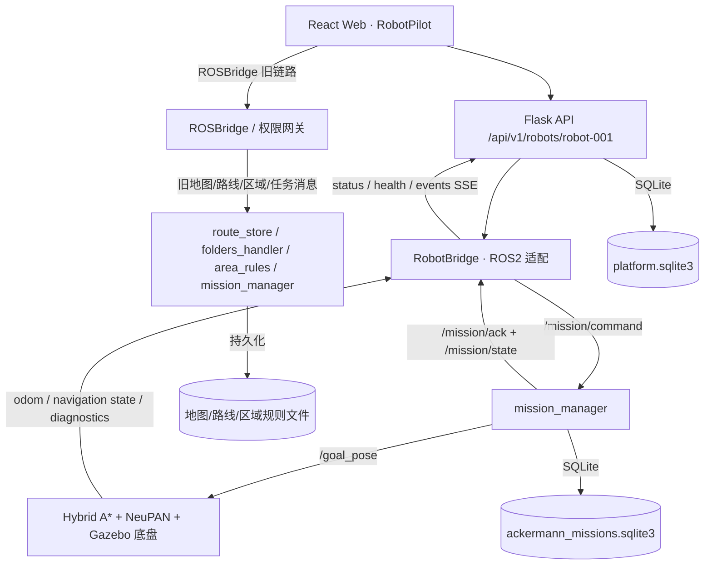

# Alpha main 分支 S0 基础架构、数据模型与机器人通信源码核对报告

> 核对日期：2026-10-09  
> 仓库：<https://github.com/YansenSong/Alpha>  
> 范围：`main` 提交 `3dba16ea67b390bb73ac94afe70a3475a1048880`  
> 核对基准：此前的《二代巡检机器人综合控制平台开发与验收清单》S0-01 ～ S0-15。  
> 当前阶段：**Gazebo 仿真优先，未来迁移实机**。  
> 核对方法：阅读 React/Vite 前端、Flask/ROS2 后端、机器人侧任务/安全节点、启动脚本及测试源码。**仅静态源码检查，未在 ROS2/Gazebo 环境实际运行、未执行测试**；代码存在不等于通过现场联调。

## 0. 总结

**总体判断：S0 已形成基本可运行的仿真控制平台骨架，但尚不能整体勾选为完成。** 已经落地的实质性能力包括：React 前端、多页面、Flask REST API、带权限的 ROSBridge 网关、机器人侧 ROS2 `mission_manager`、命令回执与 HTTP 幂等、任务及历史 SQLite、点位持久化、区域规则、状态/故障订阅、SSE 事件流、仿真电池和本地鉴权。

主要影响完整 S0 的缺口：

1. **两套写入通道并存**：版本化 REST API 和浏览器经 ROSBridge 直发命令同时存在；地图/路线/区域规则/旧任务操作尚未全量走统一命令入口。
2. **机器人端离线事件补传不完整**：机器人任务运行及执行历史可以保留，但事件总线、故障和审计缺少独立的机器人侧待补传队列与端到端 ACK/去重。
3. **统一数据契约未收口**：已有不少有 ID、有版本的对象，但任务、故障、平台事件、业务巡检结果、资产之间尚无完整公共协议及跨对象追踪链。
4. **状态判定缺项**：任务侧已经检查地图匹配、定位数据新鲜度、软件停车状态，但平台定位质量为 `unknown`，对低电、充电、网络连接和所有故障的统一运行许可还不完备。
5. **部署和版本文档尚需整理**：README 给出启动方式、依赖锁和测试；但最新提交删除了 GitHub Actions CI，部分 README 的文档链接所指文件不存在，并且根仓库和 RobotPilot 子项目说明的 ROS 发行版不一致。

**状态定义**：`基础已实现` = 已有完整的核心实现链，但仍需仿真测试；`部分实现` = 有实际代码，但与 S0 验收语义存在差距；`未形成闭环` = 只有零散机制，不能完成所述验收场景。

## 1. 前端 / 后端 / 机器人运行链路

此架构**不是单一路径**。前端使用了 `/api/v1/*`，同时依靠 ROSBridge 订阅遥测和进行部分写操作。仿真阶段可利用直连提升开发效率，正式远端部署应特别界定哪些写操作必须归一到受控接口。

### 链路 A：地图上点击导航目标 → 任务管理器

1. **前端**：[`web/src/pages/MapPage.jsx` 第 310–392 行](https://github.com/YansenSong/Alpha/blob/3dba16ea67b390bb73ac94afe70a3475a1048880/third_party/RobotPilot/web/src/pages/MapPage.jsx#L310-L392) 将单点/路线导航组装成带当前 `map_id` / `map_version_id` 的一次性任务。
2. **HTTP 客户端**：[`web/src/shared/missions/taskApi.js` 第 3–70 行](https://github.com/YansenSong/Alpha/blob/3dba16ea67b390bb73ac94afe70a3475a1048880/third_party/RobotPilot/web/src/shared/missions/taskApi.js#L3-L70) 保存 mission、POST 启动 task、提供 `Idempotency-Key`、待确认时轮询命令结果。
3. **Flask**：[`platform_api.py` 第 1664–1717 行](https://github.com/YansenSong/Alpha/blob/3dba16ea67b390bb73ac94afe70a3475a1048880/third_party/RobotPilot/ros2/src/robotpilot_ui_package/robotpilot_ui_package/platform_api.py#L1664-L1717) 通过 `dispatch()` 下发带 request ID 的任务指令。
4. **ROS2**：[`platform_api.py` 第 726–976 行](https://github.com/YansenSong/Alpha/blob/3dba16ea67b390bb73ac94afe70a3475a1048880/third_party/RobotPilot/ros2/src/robotpilot_ui_package/robotpilot_ui_package/platform_api.py#L726-L976) 的 `RobotBridge` 发布 `/mission/command`，订阅 `/mission/ack` 和 `/mission/state`。
5. **机器人本地执行**：[`mission_manager/node.py` 第 334–486 行](https://github.com/YansenSong/Alpha/blob/3dba16ea67b390bb73ac94afe70a3475a1048880/src/extension/mission_manager/mission_manager/node.py#L334-L486) 验证任务并执行，任务 ID 在启动 ACK 中返回；`store.py` 写入本地 SQLite。

**判定：任务基础通信闭环代码已存在。** 但 ACK 的 `accepted` 不代表机器人实际抵达目标；还必须跟踪 `/mission/state` 的 `SUCCEEDED` / `FAILED`。HTTP 幂等不能覆盖所有 ROSBridge 直发操作。

### 链路 B：位置 / 导航 / BMS 状态 → 页面

- 机器人本地 ROS2 → [`RobotBridge` 订阅回调](https://github.com/YansenSong/Alpha/blob/3dba16ea67b390bb73ac94afe70a3475a1048880/third_party/RobotPilot/ros2/src/robotpilot_ui_package/robotpilot_ui_package/platform_api.py#L726-L953) → [`GET /status`、`/health`、SSE `/events`](https://github.com/YansenSong/Alpha/blob/3dba16ea67b390bb73ac94afe70a3475a1048880/third_party/RobotPilot/ros2/src/robotpilot_ui_package/robotpilot_ui_package/platform_api.py#L1350-L1540) → [`useRobotStatus`](https://github.com/YansenSong/Alpha/blob/3dba16ea67b390bb73ac94afe70a3475a1048880/third_party/RobotPilot/web/src/shared/hooks/useRobotStatus.js#L1-L55) → [`InfoPage`](https://github.com/YansenSong/Alpha/blob/3dba16ea67b390bb73ac94afe70a3475a1048880/third_party/RobotPilot/web/src/pages/InfoPage.jsx)。
- 电池另有直连 ROS 订阅：[`battery.py` 发布 `/battery/state`](https://github.com/YansenSong/Alpha/blob/3dba16ea67b390bb73ac94afe70a3475a1048880/third_party/RobotPilot/ros2/src/robotpilot_ui_package/robotpilot_ui_package/battery.py#L85-L124) → [`useBatteryState`](https://github.com/YansenSong/Alpha/blob/3dba16ea67b390bb73ac94afe70a3475a1048880/third_party/RobotPilot/web/src/shared/hooks/useBatteryState.js#L1-L98) → [`BmsPage`](https://github.com/YansenSong/Alpha/blob/3dba16ea67b390bb73ac94afe70a3475a1048880/third_party/RobotPilot/web/src/pages/BmsPage.jsx)。

**判定：已有状态桥接和前端消费，但未形成统一网络心跳 / 完整数据新鲜度契约。**

### 链路 C：地图管理与区域规则

- [`MapsPage.jsx`](https://github.com/YansenSong/Alpha/blob/3dba16ea67b390bb73ac94afe70a3475a1048880/third_party/RobotPilot/web/src/pages/MapsPage.jsx#L70-L185) 经 ROSBridge 向 `/ui_operation` 发操作；[`folders_handler.py`](https://github.com/YansenSong/Alpha/blob/3dba16ea67b390bb73ac94afe70a3475a1048880/third_party/RobotPilot/ros2/src/robotpilot_ui_package/robotpilot_ui_package/folders_handler.py#L377-L510) 保存 LIO-SAM 地图、转换 PCD 至 2D、调用 `map_server/load_map`。
- [`AreaRulesEditor.jsx`](https://github.com/YansenSong/Alpha/blob/3dba16ea67b390bb73ac94afe70a3475a1048880/third_party/RobotPilot/web/src/components/AreaRulesEditor.jsx) → [`useKeepoutZones.js`](https://github.com/YansenSong/Alpha/blob/3dba16ea67b390bb73ac94afe70a3475a1048880/third_party/RobotPilot/web/src/shared/hooks/useKeepoutZones.js#L35-L175) → `/area_rules/command` → [`area_rules/node.py`](https://github.com/YansenSong/Alpha/blob/3dba16ea67b390bb73ac94afe70a3475a1048880/src/extension/area_rules/area_rules/node.py#L25-L164)；区域规则的文件持久化与乐观版本由 [`rules.py`](https://github.com/YansenSong/Alpha/blob/3dba16ea67b390bb73ac94afe70a3475a1048880/src/extension/area_rules/area_rules/rules.py#L143-L211) 实现。
- Flask 侧其实**已有** [`/maps/catalog` 元数据/版本 API](https://github.com/YansenSong/Alpha/blob/3dba16ea67b390bb73ac94afe70a3475a1048880/third_party/RobotPilot/ros2/src/robotpilot_ui_package/robotpilot_ui_package/platform_api.py#L1257-L1350) 和 [`/waypoints` CRUD API](https://github.com/YansenSong/Alpha/blob/3dba16ea67b390bb73ac94afe70a3475a1048880/third_party/RobotPilot/ros2/src/robotpilot_ui_package/robotpilot_ui_package/platform_api.py#L1584-L1660)，前端 [`useSavedWaypoints.js`](https://github.com/YansenSong/Alpha/blob/3dba16ea67b390bb73ac94afe70a3475a1048880/third_party/RobotPilot/web/src/shared/hooks/useSavedWaypoints.js#L91-L285) 已调用后者；不能沿用旧文档里“地图/点位 API 尚未实现”的结论。
- 关键限制：`MapsPage` 代码自身提示**2D 地图切换不等于 LIORF 三维点云先验热切换**。这影响 3D/2D 地图一致性验证。

## 2. S0 逐项核对表

| 编号 | S0 验收事项 | 代码实现情况 | 核对结论 | 在仿真阶段建议做什么 |
|---|---|---|---|---|
| S0-01 | 系统分层与部署 | React 前端、Flask API、ROSBridge、mission_manager、Nav2/Gazebo 已分层；有 README 和权限架构文档 | **部分实现** | 补一张以当前源码为准的部署图，列出各进程端口、数据库、断网边界和实机接入替换点 |
| S0-02 | ROS2 Topic / Service / Action / TF 接口清单 | `docs/topic_info.md`、`web/src/shared/constants/index.js`、ROS 订阅/发布和 launch 文件均存在 | **部分实现** | 收口一张统一表：名称、类型、发布者、订阅者、QoS、frame、超时、仿真与硬件的数据源差异 |
| S0-03 | 通信桥接服务 | Flask `RobotBridge`、REST、SSE、ROSBridge 权限网关均已存在，前端真实调用 | **部分实现，核心可用** | 将仍通过 ROSBridge 写入的地图、路线、区域、旧任务操作列出迁移清单；明确开发直连仅供 loopback |
| S0-04 | 统一机器人与业务对象 ID | 已有 `robot_id`、`mission_id`、`task_id`、`command_id`、`waypoint_id`、`fault_id`、地图哈希版本 | **部分实现** | 补资产 `asset_id`、巡检事件/证据 `event_id`/`evidence_id`，以及全链路外键关联和约束 |
| S0-05 | 任务 / 事件 / 故障统一消息结构 | `/mission/state` 有 `schema_version`；`/battery/state`、平台故障有结构化字段；REST 响应部分一致 | **部分实现** | 定义正式 JSON 契约（schema_version、robot_id、发生时间、来源、task_id、状态、错误码）；适配各模块 |
| S0-06 | 指令 ACK 与去重 | API `Idempotency-Key`+命令表+ROS ACK+待确认轮询已实现；ROSBridge 直发写操作和机器端全部命令未统一去重 | **部分实现，任务 API 通路较成熟** | 为所有危险/业务写命令分配 request_id，重复 POST 返回同一结果；测试页面重复点击、超时重发、重启后重发 |
| S0-07 | 机器人连接/心跳/新鲜度 | WebSocket 重连、前端 stale、RobotBridge 多种 ROS 状态采集与超时检查已实现 | **部分实现** | 定义一个机器级 Heartbeat/ConnectionStatus，包括最后一次收到消息时间、连接类型、网络状态；做断连测试 |
| S0-08 | 状态机及状态约束 | mission_manager 有运行、暂停、成功、失败、取消等状态，校验地图、定位新鲜度、软件停车；底盘 mux 有超时/hold/区域防护 | **部分实现** | 补机器人级运行许可，纳入低电、充电、定位质量、故障等级；测试非法状态拒绝及恢复 |
| S0-09 | 地图坐标与时间同步 | 位姿 frame_id、地图绑定、UTC ISO 时间、2D 栅格哈希 ID 和 ROS TF 基础存在 | **部分实现** | 做 Gazebo `/clock`、LiDAR/IMU/里程计/TF/网页地图位置的时间与坐标一致性试验；明确 2D/3D 地图绑定 |
| S0-10 | 基础数据持久化 | 机器人 mission SQLite、Flask platform SQLite、Auth SQLite、区域规则 JSON、地图与路线文件已有 | **部分实现，核心储存可用** | 扩充资产、巡检结果、设备状态快照、告警证据等模型，并编写重启恢复测试 |
| S0-11 | 离线缓存与恢复补传 | 已有任务本地持久化、平台 SSE 历史以及断线重连；未发现机器人侧独立、可靠的故障/事件 outbox→平台补传闭环 | **未形成完整闭环** | 优先设计带递增 seq 的 robot_event_outbox、ACK 游标、幂等入库；仿真中中断后端再恢复验证 |
| S0-12 | 鉴权、加密、控制权限 | `local` 账号/session+CSRF、TLS 校验、按角色网关，`open` 强制本机 loopback；仓库未提供实际生产 HTTPS 代理部署 | **部分实现，安全基础较完整** | 保留当前本机 open 仿真；远端模式做 HTTPS、Origin、9090 不外露、非法命令拒绝和权限回归测试 |
| S0-13 | 日志、错误码、追踪 | 后端任务事件、命令记录、faults、audit、ROS 日志、Logs 页面；但前端 Events 页仅保存到浏览器 localStorage | **部分实现** | 将平台事件/审计查询与前端统一，支持按 task_id/request_id/robot_id 和时间追踪；标准化错误码 |
| S0-14 | 仿真 / 假数据联调 | Gazebo、仿真运动，`ROBOT_MODE=simulation`，电池 `BATTERY_SOURCE=sim`、Scenario API、`simulated` 字段 | **仿真基础已实现** | 增加标准场景：断连、低电、充电、定位丢失、故障；页面显式区分仿真/硬件来源。独立纯 Mock UI 不应视作已充分完成 |
| S0-15 | 开发环境及可复现部署 | npm lock、Vite/React 脚本、ROS colcon/launch、综合开发启动脚本、README、单元测试文件已存在 | **部分实现** | 固定 Humble/Jazzy 的实际运行配置、补充缺失文档、恢复 CI 或提供一键测试、从干净环境执行重建 |

### 各项直接源码证据与误判提醒

**S0-01 / S0-02**：[`README.md`](https://github.com/YansenSong/Alpha/blob/3dba16ea67b390bb73ac94afe70a3475a1048880/README.md) 和 [`docs/topic_info.md`](https://github.com/YansenSong/Alpha/blob/3dba16ea67b390bb73ac94afe70a3475a1048880/docs/topic_info.md) 展示既有导航链路；[`web/src/shared/constants/index.js`](https://github.com/YansenSong/Alpha/blob/3dba16ea67b390bb73ac94afe70a3475a1048880/third_party/RobotPilot/web/src/shared/constants/index.js#L1-L81) 是前端话题常量，但不能替代完整 ROS graph 核对和 QoS/TF 契约。

**S0-03**：浏览器核心 REST 见 [`apiFetch.js`](https://github.com/YansenSong/Alpha/blob/3dba16ea67b390bb73ac94afe70a3475a1048880/third_party/RobotPilot/web/src/shared/api/apiFetch.js#L57-L91)，后端见 [`platform_api.py`](https://github.com/YansenSong/Alpha/blob/3dba16ea67b390bb73ac94afe70a3475a1048880/third_party/RobotPilot/ros2/src/robotpilot_ui_package/robotpilot_ui_package/platform_api.py)。前端另有 [`MissionClient.jsx`](https://github.com/YansenSong/Alpha/blob/3dba16ea67b390bb73ac94afe70a3475a1048880/third_party/RobotPilot/web/src/components/MissionClient.jsx#L14-L82) 经 `/mission/command` 直接 ROSBridge 写入；[`MapsPage.jsx`](https://github.com/YansenSong/Alpha/blob/3dba16ea67b390bb73ac94afe70a3475a1048880/third_party/RobotPilot/web/src/pages/MapsPage.jsx#L152-L183)、[`RoutePage.jsx`](https://github.com/YansenSong/Alpha/blob/3dba16ea67b390bb73ac94afe70a3475a1048880/third_party/RobotPilot/web/src/pages/RoutePage.jsx)、[`useKeepoutZones.js`](https://github.com/YansenSong/Alpha/blob/3dba16ea67b390bb73ac94afe70a3475a1048880/third_party/RobotPilot/web/src/shared/hooks/useKeepoutZones.js#L115-L155) 也有直写。

**S0-04 / S0-05**：平台表结构见 [`platform_api.py` 第 119–282 行](https://github.com/YansenSong/Alpha/blob/3dba16ea67b390bb73ac94afe70a3475a1048880/third_party/RobotPilot/ros2/src/robotpilot_ui_package/robotpilot_ui_package/platform_api.py#L119-L282)，任务/执行/事件存储见 [`mission_manager/store.py` 第 17–133 行](https://github.com/YansenSong/Alpha/blob/3dba16ea67b390bb73ac94afe70a3475a1048880/src/extension/mission_manager/mission_manager/store.py#L17-L133)，领域定义见 [`CONTEXT.md`](https://github.com/YansenSong/Alpha/blob/3dba16ea67b390bb73ac94afe70a3475a1048880/CONTEXT.md)。现有 `runs` 和 `missions` 表依赖单机器人实例约束，未把 `robot_id` 放进每一行主键；未来多机/迁移时需考虑作用域。

**S0-06**：[`PlatformStore.reserve_command()` 与 `dispatch()`](https://github.com/YansenSong/Alpha/blob/3dba16ea67b390bb73ac94afe70a3475a1048880/third_party/RobotPilot/ros2/src/robotpilot_ui_package/robotpilot_ui_package/platform_api.py#L380-L415) / [`dispatch()`](https://github.com/YansenSong/Alpha/blob/3dba16ea67b390bb73ac94afe70a3475a1048880/third_party/RobotPilot/ros2/src/robotpilot_ui_package/robotpilot_ui_package/platform_api.py#L1202-L1254)，前端 [`taskApi.js`](https://github.com/YansenSong/Alpha/blob/3dba16ea67b390bb73ac94afe70a3475a1048880/third_party/RobotPilot/web/src/shared/missions/taskApi.js#L3-L35)，机器人 [`on_command`](https://github.com/YansenSong/Alpha/blob/3dba16ea67b390bb73ac94afe70a3475a1048880/src/extension/mission_manager/mission_manager/node.py#L357-L443)。**同一个 HTTP 幂等键已去重；两次 UI 点击各生成新 UUID 不属于同一个幂等键**。因此还应检查按钮 pending 锁定、机器端 request_id 的执行记录去重。

**S0-07**：前端 [`App.jsx` 第 160–226 行](https://github.com/YansenSong/Alpha/blob/3dba16ea67b390bb73ac94afe70a3475a1048880/third_party/RobotPilot/web/src/app/App.jsx#L160-L226)、[`useRobotStatus.js`](https://github.com/YansenSong/Alpha/blob/3dba16ea67b390bb73ac94afe70a3475a1048880/third_party/RobotPilot/web/src/shared/hooks/useRobotStatus.js)、后端 [`RobotBridge.snapshot()`](https://github.com/YansenSong/Alpha/blob/3dba16ea67b390bb73ac94afe70a3475a1048880/third_party/RobotPilot/ros2/src/robotpilot_ui_package/robotpilot_ui_package/platform_api.py#L924-L952)。`/status.online` 基于位姿或里程计是否新鲜，不等于 5G/Wi-Fi 网络本身已验证连通。

**S0-08**：[`mission_manager/node.py` 第 180–228 行](https://github.com/YansenSong/Alpha/blob/3dba16ea67b390bb73ac94afe70a3475a1048880/src/extension/mission_manager/mission_manager/node.py#L180-L228) 和 [`第 334–490 行`](https://github.com/YansenSong/Alpha/blob/3dba16ea67b390bb73ac94afe70a3475a1048880/src/extension/mission_manager/mission_manager/node.py#L334-L490)；[`cmd_vel_mux.py`](https://github.com/YansenSong/Alpha/blob/3dba16ea67b390bb73ac94afe70a3475a1048880/src/control/vehicle_control/cmd_vel_mux.py#L400-L450) 已含超时、hold、软件停车和区域规则约束；但 [`platform_status` 的 `localization.quality` 为固定 `unknown`](https://github.com/YansenSong/Alpha/blob/3dba16ea67b390bb73ac94afe70a3475a1048880/third_party/RobotPilot/ros2/src/robotpilot_ui_package/robotpilot_ui_package/platform_api.py#L1360-L1380)。定位失效保护目前主要体现为新鲜度/数据不可用判断，不等同于完整的定位质量状态机。

**S0-09**：ROS 文档有 [`/clock`、`/tf` 和地图 frame`](https://github.com/YansenSong/Alpha/blob/3dba16ea67b390bb73ac94afe70a3475a1048880/docs/topic_info.md)，但必须用 Gazebo 运行态校验多个传感器及后端 UTC 事件一致性。地图切换范围可直接见 [`MapsPage.jsx` 第 175–184 行](https://github.com/YansenSong/Alpha/blob/3dba16ea67b390bb73ac94afe70a3475a1048880/third_party/RobotPilot/web/src/pages/MapsPage.jsx#L175-L184)。

**S0-10**：除了 SQLite，区域规则实际持久化于 [`area_rules/rules.py`](https://github.com/YansenSong/Alpha/blob/3dba16ea67b390bb73ac94afe70a3475a1048880/src/extension/area_rules/area_rules/rules.py#L143-L211) 的 JSON；平台点位 API 的 [`waypoint_payload()`](https://github.com/YansenSong/Alpha/blob/3dba16ea67b390bb73ac94afe70a3475a1048880/third_party/RobotPilot/ros2/src/robotpilot_ui_package/robotpilot_ui_package/platform_api.py#L1119-L1182) **明确拒绝** 非 `none` 的动作或感知类型，即点位数据库模型虽然预留字段，业务动作尚未接入。

**S0-11**：[`mission_manager/store.py`](https://github.com/YansenSong/Alpha/blob/3dba16ea67b390bb73ac94afe70a3475a1048880/src/extension/mission_manager/mission_manager/store.py) 是机器人任务运行侧的持久记录；[`platform_api.py` 第 323–377 行](https://github.com/YansenSong/Alpha/blob/3dba16ea67b390bb73ac94afe70a3475a1048880/third_party/RobotPilot/ros2/src/robotpilot_ui_package/robotpilot_ui_package/platform_api.py#L323-L377) 保存平台侧最近事件，SSE 用 [`Last-Event-ID`](https://github.com/YansenSong/Alpha/blob/3dba16ea67b390bb73ac94afe70a3475a1048880/third_party/RobotPilot/ros2/src/robotpilot_ui_package/robotpilot_ui_package/platform_api.py#L1483-L1541) 续传**平台已存储**的事件；二者不代表平台不在线期间发生的所有机器人事件都会被主动补传。前端 [`EventsPage.jsx`](https://github.com/YansenSong/Alpha/blob/3dba16ea67b390bb73ac94afe70a3475a1048880/third_party/RobotPilot/web/src/pages/EventsPage.jsx#L16-L55) 明确写“数据保存在 localStorage”；[`eventLog.js`](https://github.com/YansenSong/Alpha/blob/3dba16ea67b390bb73ac94afe70a3475a1048880/third_party/RobotPilot/web/src/shared/events/eventLog.js#L1-L65) 上限 500 条，不能当作跨终端事故档案。

**S0-12**：[`auth.py`](https://github.com/YansenSong/Alpha/blob/3dba16ea67b390bb73ac94afe70a3475a1048880/third_party/RobotPilot/ros2/src/robotpilot_ui_package/robotpilot_ui_package/auth.py#L26-L70) 强制 open 仅 loopback、local TLS；[`auth.py` 第 240–399 行](https://github.com/YansenSong/Alpha/blob/3dba16ea67b390bb73ac94afe70a3475a1048880/third_party/RobotPilot/ros2/src/robotpilot_ui_package/robotpilot_ui_package/auth.py#L240-L399) 包含角色、机器人作用域、CSRF；[`rosbridge_gateway.py`](https://github.com/YansenSong/Alpha/blob/3dba16ea67b390bb73ac94afe70a3475a1048880/third_party/RobotPilot/ros2/src/robotpilot_ui_package/robotpilot_ui_package/rosbridge_gateway.py#L20-L172) 针对 `publish` 和 `call_service` 设权限白名单，禁用直接 `/cmd_vel`。**但 Operator 仍被允许原始 `/mission/command`、`/goal_pose`，Engineer 仍能发 `/ui_operation`**，绕开统一 REST 幂等，虽然网关会记 ROS 操作审计。生产网络还必须确认原生 9090 仅本地可达。

**S0-13**：后端有 [`platform_api.py` 故障/审计表](https://github.com/YansenSong/Alpha/blob/3dba16ea67b390bb73ac94afe70a3475a1048880/third_party/RobotPilot/ros2/src/robotpilot_ui_package/robotpilot_ui_package/platform_api.py#L119-L220)、[`faults` API](https://github.com/YansenSong/Alpha/blob/3dba16ea67b390bb73ac94afe70a3475a1048880/third_party/RobotPilot/ros2/src/robotpilot_ui_package/robotpilot_ui_package/platform_api.py#L1839-L1912) 和 [`logs` API](https://github.com/YansenSong/Alpha/blob/3dba16ea67b390bb73ac94afe70a3475a1048880/third_party/RobotPilot/ros2/src/robotpilot_ui_package/robotpilot_ui_package/platform_api.py#L2062-L2168)；前端 [`LogsPage.jsx`](https://github.com/YansenSong/Alpha/blob/3dba16ea67b390bb73ac94afe70a3475a1048880/third_party/RobotPilot/web/src/pages/LogsPage.jsx) 调用日志 API，但 [`EventsPage.jsx`](https://github.com/YansenSong/Alpha/blob/3dba16ea67b390bb73ac94afe70a3475a1048880/third_party/RobotPilot/web/src/pages/EventsPage.jsx) **没有查询这些平台事件或 faults**。审计写入存在，但未在已核对的 `/api/v1/*` 中发现通用 `GET /audit` 的检索接口。

**S0-14**：[`scripts/run_robotpilot.sh` 第 58–79 行](https://github.com/YansenSong/Alpha/blob/3dba16ea67b390bb73ac94afe70a3475a1048880/scripts/run_robotpilot.sh#L58-L79) 在本地开发将 `ROBOT_MODE` 设 `simulation`，电池来源 `sim`；[`battery.py`](https://github.com/YansenSong/Alpha/blob/3dba16ea67b390bb73ac94afe70a3475a1048880/third_party/RobotPilot/ros2/src/robotpilot_ui_package/robotpilot_ui_package/battery.py#L22-L64) 确保 `sim/serial/disabled` 模式明确，前端 [`BmsPage.jsx`](https://github.com/YansenSong/Alpha/blob/3dba16ea67b390bb73ac94afe70a3475a1048880/third_party/RobotPilot/web/src/pages/BmsPage.jsx#L15-L75) 禁止非模拟场景调用。老 [`DemoModeBanner.jsx`](https://github.com/YansenSong/Alpha/blob/3dba16ea67b390bb73ac94afe70a3475a1048880/third_party/RobotPilot/web/src/components/DemoModeBanner.jsx) 组件存在，然而 [`runtimeConfig.js`](https://github.com/YansenSong/Alpha/blob/3dba16ea67b390bb73ac94afe70a3475a1048880/third_party/RobotPilot/web/src/shared/constants/runtimeConfig.js#L6-L25) 不再默认启用 demoMode 且会从旧浏览器配置删除该字段；所以**不能认为整套前端“脱离 ROS 的纯 Mock 模式”已可靠具备**。当前优势是接真实 Gazebo 仿真栈。

**S0-15**：[`README.md`](https://github.com/YansenSong/Alpha/blob/3dba16ea67b390bb73ac94afe70a3475a1048880/README.md)、[`scripts/run_robotpilot.sh`](https://github.com/YansenSong/Alpha/blob/3dba16ea67b390bb73ac94afe70a3475a1048880/scripts/run_robotpilot.sh)、[`web/package.json`](https://github.com/YansenSong/Alpha/blob/3dba16ea67b390bb73ac94afe70a3475a1048880/third_party/RobotPilot/web/package.json) 和单测文件（例如 [`test_platform_api.py`](https://github.com/YansenSong/Alpha/blob/3dba16ea67b390bb73ac94afe70a3475a1048880/third_party/RobotPilot/ros2/src/robotpilot_ui_package/test/test_platform_api.py)、[`useSavedWaypoints.integration.test.js`](https://github.com/YansenSong/Alpha/blob/3dba16ea67b390bb73ac94afe70a3475a1048880/third_party/RobotPilot/web/src/shared/hooks/useSavedWaypoints.integration.test.js)）是已有基础。最新 [`3dba16e` 提交](https://github.com/YansenSong/Alpha/commit/3dba16ea67b390bb73ac94afe70a3475a1048880) 移除了 `.github/workflows/web-robotpilot.yml`。仓库树未包含 RobotPilot README 链接的 `docs/deployment/run-profiles.md`、`docs/web-storage-migration.md`；根 README 默认 Humble、RobotPilot README 的独立构建说明使用 Jazzy，建议统一并测试实际组合。

## 3. 仿真优先：建议下一步开发顺序

**第一批（S0 收尾首要）**

- [ ] **S0-FIX-01｜统一远端写命令入口**：梳理前端 ROSBridge 全部 `publish()` / `callService()`，列出控制面与纯读取面；MapPage 单次任务已走 REST，进一步迁移地图写、区域规则写、老任务写与风险操作，所有命令写入 `request_id` / actor / timestamp / accepted / terminal 状态。保留独立的本机调试 profile，不公开原始端口。
- [ ] **S0-FIX-02｜机器人侧离线事件 Outbox**：在机器人侧用 SQLite 保存 `event_id`、`robot_id`、`task_id`、`type`、`occurred_at`、`payload`、`seq`、`delivered_at`；恢复连接后按 seq 批量同步，平台以唯一键去重；故障和任务事件比高频位姿更优先。
- [ ] **S0-FIX-03｜统一跨模块 ID / DTO**：确定 robot/map/map_version/waypoint/mission/task/command/fault/asset/evidence 的字段与关联；版本化 `mission_state`, `fault`, `robot_status`, `inspection_event` 结构，配 schema 验证。
- [ ] **S0-FIX-04｜完成机器级运行许可与连接模型**：有明确 `online`、`last_heartbeat`、`data_freshness`、`network_transport`、`localization_quality`、`charging_state`、`stop_active`，把“禁止移动”的规则放在机器人侧而不是只在网页上隐藏按钮。

**第二批（让已存在的功能可靠、可演示）**

- [ ] **S0-FIX-05｜统一前端事件/故障展示**：`EventsPage` 从平台 API 拉取历史、从 SSE 收增量；浏览器 `localStorage` 只能保留 UI 偏好或临时演示日志，不作为审计真相。
- [ ] **S0-FIX-06｜2D/3D 地图一致性**：地图版本必须明确关联 `GlobalMap.pcd` + `map.yaml/.pgm`；在切图未加载匹配 LIORF 先验时禁止发起自主任务，或在仿真阶段明确“必须重启定位导航”的工作流。
- [ ] **S0-FIX-07｜恢复运行验证**：运行 Gazebo+RobotPilot，测试任务中关闭浏览器、重启 Flask、断开 ROSBridge、软件停车、失定位、地图变更、重启 mission_manager；保存时间戳日志和结果。
- [ ] **S0-FIX-08｜开发文档与自动检查**：更新旧接口文档已实现的地图和点位 API；补齐部署文档、统一 ROS 版本、恢复 npm/pytest/colcon 检查（CI 可后续，至少提供可复现脚本）。

**第三批（迁移实机时，不要求现在全部做完）**

- [ ] **S0-HW-01｜替换设备适配层**：用真实 LiDAR、IMU、轮速/BMS/底盘通信替换 Gazebo 与模拟电池数据源；保持上层 API/消息兼容。
- [ ] **S0-HW-02｜实际网络/安全部署**：配置 LAN/5G、Wi-Fi 心跳、HTTPS 证书、反向代理、ACL/防火墙；拒绝公开访问 9090 与 DDS；验证断网后安全运动与恢复。
- [ ] **S0-HW-03｜硬件级安全**：确保本地急停、控制器故障和制动优先于网页/ROS 指令；软件停车与物理 E-stop 分开记录和验收。

## 4. 最低可执行的仿真验收用例

| 编号 | 测试动作 | 预期 / 所需证据 | 对应 S0 |
|---|---|---|---|
| SIM-01 | 启动 Gazebo、导航、RobotPilot 后登录/进入页面 | 地图、pose、navigation、battery 及时更新；无数据时显示 stale/unknown 而非虚假绿灯 | 02、03、07、09、14、15 |
| SIM-02 | 在地图中保存一个点位、刷新页面、重启 Flask | 点位从 `/waypoints` 持久返回；显示 map_id、revision | 04、05、10 |
| SIM-03 | 从 MapPage 下发单点任务 | HTTP 返回 command_id；ROS `/mission/ack` 关联，最终状态转 `SUCCEEDED` 或 `FAILED` | 03、06、08、13 |
| SIM-04 | 使用相同 `Idempotency-Key` 重复 POST | 不产生第二次任务执行；旧 key 改 body 应冲突 | 06 |
| SIM-05 | 运行中 pause、resume、cancel，并在软件停车激活时尝试 start | 指令被机器人端确认执行或明确拒绝；底盘不越过 stop 安全许可 | 06、08、12 |
| SIM-06 | 进行地图规则编辑和地图切换 | 规则持久、地图版本一致；切换仅 2D 时禁止误报 LIORF 已同步 | 02、08、09、10 |
| SIM-07 | 让任务继续执行，关闭浏览器再进入 | 任务定义/执行记录与状态仍来自 mission_manager，而不是浏览器本地缓存 | 01、10、11 |
| SIM-08 | 后端完全离线期间产生故障/任务事件，之后恢复 | **当前待实现**：事件能基于机器人 outbox 与 seq 补传，不重复、不丢失 | 05、11、13 |
| SIM-09 | Viewer 尝试地图更改、未经登录者向网关发运动指令 | 无授权的写入被拒绝；ROSBridge 原始端口不对非可信网络开放 | 12 |
| SIM-10 | 新机器按文档编译启动；执行前后端测试 | 能重复构建；记录每项测试执行结果、版本、失败原因 | 15 |

> 结论边界：上述代码核对没有运行测试，因此任何“已经编码”的项目只意味着**有可检查的实现依据**，并不意味着已完成 S0 现场验收。
