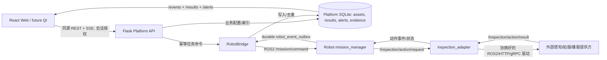

# Alpha S1 工程实施交接文档（交付 Codex）

> **项目**：二代室内外自主巡检机器人 · Alpha（先 Gazebo 仿真，后迁移实机）
> **交接目标**：在已经实现的 S0 架构上完成 S1 的 **Web 管理端 / 可复用 Qt 接口 / 业务编排与展示**，不开发外部识别模型。
> **仓库**：[YansenSong/Alpha](https://github.com/YansenSong/Alpha)，核查的公开 `main` 基线：`fd998a40100fe51ab348dbaf7216dcc2e2a51dc2`（提交时间 2026-10-10 02:49 UTC）。
> **重要说明**：Codex 实际操作的是用户**本地仓库**；公开 main 与本地 HEAD 可能不同，**先核查本地再决定修改**。本文件是任务指令，不是已完成状态声明。
> **目标保存路径**：`docs/s1/CODEX_HANDOFF.md`（将本文件复制到本地该路径）。
> **需求源**：`docs/网页开发需求.md`（若本地路径不同，查找标题“二代巡检机器人综合控制平台：分阶段开发与验收功能清单”）；原始合同附件一第 18、19、21 项，技术标准第 4、7～10 章。
> **阶段立场**：S0 按用户决定暂时冻结，不再以“全部修完 S0”作为启动本任务的前提；遇到影响 S1 的遗留依赖时做**最小必要修补、回归不破坏 S0**，并如实记录。

---

## 0. 给 Codex 的最高优先级执行指令

你已在 **Alpha 本地仓库根目录**。必须**实际修改源码并测试**，不是仅写方案或美化页面。按本文 W0～W9 小批次实现 S1-01～S1-57，业务识别算法和模型由其他团队完成；你只负责接入契约、适配器、到点动作编排、数据库、后端服务、Web UI、可供 Qt 复用的 API 与仿真联调。

**不可违反的底线**：

1. **保留 S0**：任务权威仍在 `src/extension/mission_manager`，不要在 Flask 或 React 新建第二套任务执行器；复用现有任务 ACK/幂等、Outbox、SSE、机器人安全门禁、地图 bundle 校验。
2. **不实现识别模型**：禁止自行实现 YOLO/识别训练/烟火或安全帽判定/人脸、热红外融合算法。可开发 **`InspectionProvider` 契约、ROS2/HTTP 适配、能力握手和可控测试替身**。不编造识别准确率或虚构真实检测证据。
3. **任务执行以机器人为准**：只有导航端报告 ARRIVED 并且停车/定位等机器人侧安全条件确认后，才触发到点检测动作；`HTTP 202`、ROS ACK、动作完成与识别结果**是不同的状态**。
4. **真实/仿真/假数据三态必须明确**：`hardware`、`simulation`、`fixture`（或同等标记）；无算法提供方时显示 **未连接/能力不可用/等待外部接口**，严禁自动回填“正常”或“检测成功”。
5. **业务写操作只走受保护的同源平台 API**：具备服务端鉴权、权限、参数校验、审计、幂等/版本控制和错误反馈。不要通过网页新增未经授权的 rosbridge `publish` 来控制任务/安全规则。S0 遗留地图/路线/区域写入口只在 S1 涉及处增量收口。
6. **Web 先落地，Qt 后复用**：仓库现在有 React/Vite + Flask/ROS2，未看到现成 Qt 项目。因此本批交付**完整 Web 工作流与稳定、版本化、与 UI 无关的 API**；默认**不新建一套空 Qt 项目**。需要 Qt 时可在相同 API/SSE 契约上开发客户端，不把 React hooks 作为唯一逻辑实现。
7. **不破坏现有数据**：SQLite 用非破坏性迁移，留好备份与回滚；不得删除用户地图/点位/路线、任务历史或本地 `*.pcd`。对地图 2D/3D 不一致始终 fail-closed。
8. 每个 W 阶段产出代码 + 测试 + 文档。条件缺失时通过**可信状态与阻断说明**交付可测适配层，不擅自宣称外部识别能力已经验收。

**最终必须生成**：`docs/s1/S1_IMPLEMENTATION_REPORT.md`、`docs/s1/INSPECTION_PROVIDER_CONTRACT.md`、`docs/s1/S1_TEST_MATRIX.md`、`docs/s1/API_AND_DATA_MODEL.md`、`docs/s1/INTEGRATION_PENDING.md`（无人交付算法接口时明确约束）、至少一套可复现的模拟结果测试夹具、必要的迁移和启动说明。

## 1. 范围、职责和验收边界

### 1.1 本次你负责的内容

- **可视化**：运行大屏、地图/区域/点位/资产、任务模板与调度、运行状态、检测结果、告警与证据、机器人健康/BMS。
- **编排**：将点位、动作计划、业务模块能力和任务模板关联，形成**机器人端执行的、可追踪的动作序列**；页面只负责配置/下发/查阅/处置。
- **服务端**：`assets`、`inspection_results`、`event_evidence` 等存储读写、动作计划与业务告警管理、API、权限校验、媒体证据安全访问、业务事件去重。
- **最小机器人端适配**：`mission_manager` 增加非导航动作的受控派发/回执/超时/暂停重试语义；可单设 `inspection_adapter` ROS2 节点对接外部服务。**不实现感知算法本体**。
- **集成测试**：本机独立 ROS_DOMAIN_ID、隔离 SQLite、可替身化检测接口、Web API/React 端到端模拟；有真实 provider 后按同一测试矩阵换成真实接口联调。
- **Qt 兼容**：API、SSE、对象关系和设备数据不依赖浏览器 localStorage；编写 Qt 客户端接入协议示例或文档，不要求本阶段开发完整 Qt 页面。

### 1.2 明确不由你实现

- 火焰/烟雾/积水/漏水/安全帽/消防设施/陌生人员/货位等**检测算法**、模型训练、数据集、性能指标；由业务感知团队提供。
- 相机 SDK、热成像 SDK、AI 推理 runtime、云台驱动和真实语音引擎的内部实现；它们只作为有能力发现与执行回执的外部模块接入（若其他开发者已有实现，复用）。
- 更换 LIO-SAM、LIORF、Hybrid A*、NeuPAN、自主安全控制；不降低 S0 的软件停车、地图绑定与安全规则。
- 仅靠 UI 模拟即可声称“已拍摄”“算法确认异常”“充电成功”“巡检完成”；没有提供方就返回 `unavailable`/`pending_integration`。
- 原生 Qt 应用、本体安卓/鸿蒙屏、S2 的完整讲解交互与识别专项能力不在 S1 必做范围。S1 的 `broadcast` 步骤只留标准接入，不内置语音合成。

### 1.3 验收分层（必须分别填报）

| 状态 | 意义 | 可报告的结论 |
|---|---|---|
| `CODE_READY` | 对应源码、接口、测试存在且通过 | “已实现代码/测试” |
| `SIM_VERIFIED` | Gazebo + 新版 Web/ROS2 进程完成端到端联动，留日志 | “仿真验证通过” |
| `FIXTURE_VERIFIED` | 使用标记为 fixture 的外部业务能力替身通过编排/展示流程 | “接口替身闭环通过，不代表真实检测” |
| `EXTERNAL_PENDING` | 待业务感知团队提供协议、数据和服务 | “联调待外部接口” |
| `REAL_VERIFIED` | 有实机/真实算法的完整运行、指标、证据 | 只有真实试验后才可宣称 |
| `BLOCKED` | 依赖缺失或安全前置未满足 | 列出阻断原因与复现命令 |

**S1 交付分成“平台功能与接入层完成”和“外部算法/实机联合验收”两层**：第一层 Codex 可以独立完成；第二层只有外部团队和现场条件满足后才能完成。**不把外部算法暂未交付错误归类为你的未开发能力**，但也不得将它认定为真实检测完成。

## 2. 当前仓库事实（用于避免重复造轮子）

下列事实按公开 `main@fd998a4` 的静态阅读记录，**仅供本地核查起点**。若本地分支已实现更新内容，以本地源码为准更新本表。

| 位置 | 已有实现/现状 | 本阶段策略 |
|---|---|---|
| `third_party/RobotPilot/web/src/pages/registry.js` | `/`、`/route`、`/maps`、`/info`、`/health`、`/events`、`/bms`；scheduler 在通用模式存在 | 扩展或重排现有页面，不重建应用路由/布局 |
| `web/src/pages/MapPage.jsx`、`components/Map.jsx` | 2D 地图/位姿、轨迹与可视化、导航和一次性任务入口 | 做 Cockpit 聚合、告警标记/进度接入；保留地图现有功能 |
| `web/src/pages/MapsPage.jsx`、`AreaRulesEditor.jsx`、`useKeepoutZones.js` | 地图列表和 keepout/speed/wall/closure 编辑；部分写操作仍经 rosbridge | 原地补区域类型和安全 API/发布确认；不要令 2D 单独热切换绕开 bundle |
| `web/src/shared/hooks/useSavedWaypoints.js`、`WaypointLibrary.jsx` | 点位以 `map_id`/版本绑定并调用 `/waypoints` CRUD | 复用点位坐标/版本模型，在此上加业务动作和资产关联 |
| `web/src/pages/RoutePage.jsx`、`SchedulerPage.jsx` | 路线编辑和计划调度已有，旧路线文件与任务模板存在 | 统一任务编辑和动作计划，兼容老路线；不双重调度 |
| `web/src/shared/missions/taskApi.js`、`missionClient.js` | 控制走平台 API；ACK 查询与命令状态处理 | 复用，增加巡检执行步骤、结果列表及用户反馈 |
| `web/src/pages/EventsPage.jsx`、`useRobotStatus.js` | 已使用平台历史 `/events/history` 与 SSE 提醒 | 基础事件时间线保留，业务告警独立聚合查询 + 链接证据 |
| `web/src/pages/BmsPage.jsx`、`InfoPage.jsx`、`HealthPage.jsx` | 电池模拟/硬件标识、健康页、状态读写已有 | 复用源数据，补缺失态和本阶段管理项，不重写电池算法 |
| `.../robotpilot_ui_package/platform_api.py` | Flask `/api/v1/robots/<robot_id>`、ACK/审计/状态/SSE/事件 Outbox 消费；SQLite 已有 `assets`、`inspection_results`、`event_evidence`、`device_snapshots` **基础表** | 对基础表实施增量迁移、完成读写 API/索引/对外结果落地；避免新建重复 SQLite 存储 |
| `.../robotpilot_ui_package/auth.py`、`rosbridge_gateway.py` | `open`/`local`、Viewer/Operator/Engineer/Admin 权限；local 网关只准部分旧写入 | 扩展明确策略；不放开 `/mission/command` 和底盘原始控制 |
| `src/extension/mission_manager/mission_manager/node.py` | 已支持 `waypoint`、`wait`、`home`、`dock`、`undock`；新任务/恢复要过安全/地图 bundle 门禁；已实现 Outbox | **必须显式新增可等待回执的 inspection action**；不能让页面直接按计时器猜动作完成 |
| `src/extension/mission_manager/mission_manager/store.py` | 任务/运行/事件/命令去重/Outbox SQLite 已有 | 小步版本迁移；动作实例与结果事件在机器人侧关联并持久化 |
| `src/extension/area_rules/area_rules/node.py` | 持久规则与 Nav2 keepout mask/速度保护已有 | 新增工作区类型须同时有机器人实际执行/安全联动，不能只有画图 |
| `docs/s0/map-bundle.md` | 2D/3D 清单和冷切换安全准则 | 严格延续，不将 2D `map_server` 切换当成 3D 定位地图切换 |
| `docs/s0/S0_IMPLEMENTATION_REPORT.md` | 说明近距离 Gazebo 导航做过验证，仍留有若干 S0 约束 | 只作已知限制来源，不重新开启整个 S0 范围 |

**确定需要修补的代码缺口**：当前 `platform_api.py::waypoint_payload` 明确拒绝 `action != 'none'` 或 `perception_type != null`；`validated_mission` 对非导航/等待/回充步骤拒绝。平台的三个业务基础表目前不能证明任何真正的外部识别结果已经写入。现有 `EventsPage` 不是完整的业务巡检/告警中心。

## 3. 建议的模块边界（必须坚持“单一事实来源”）



**设计约束**：

- `MissionManager` 是**任务执行/步骤推进/重试/暂停恢复**唯一权威；浏览器关闭不能停止任务。`inspection_adapter` 是外部服务适配器，不可自行启动下一巡检点。
- `PlatformStore` 是**资产台账、业务结果索引、告警处置、证据元数据**权威；不要另建前端 localStorage 业务数据库。机器人端 Outbox 承担断网时业务结果和终态事件的可靠存储；不能只靠 Flask 在在线期间订阅一次消息。
- `Fault` 是机器人硬件/运行故障，`InspectionAlert` 是业务感知异常，**独立 ID 和生命周期**；UI 可聚合展示，不应复用故障 `ack/clear` 语义覆盖巡检整改流程。
- 区分 `TaskExecution`（`task_id`）、`Mission`（模板 `mission_id`）、`InspectionAction`（动作实例 `action_run_id`）、`InspectionResult`、`InspectionAlert` 与 `Evidence`。每条结果必须携带足够关联字段，不能从“当前任务”猜测归属。
- 任务保存后应对点位、资产、动作计划、地图版本形成**执行快照**。后来编辑模板不得改变已运行任务或已有周期任务的过去执行。

## 4. 外部业务模块最小接入协议（由 Codex 首先实现）

### 4.1 接口对接策略

外部团队尚未提供最终接口。Codex 先定义 `InspectionProvider` **逻辑契约**和版本化标准消息（文档 + 验证器 + Adapter），再通过配置切换实际 ROS2/HTTP（用户及外部团队确认后决定）。**首选 ROS2 内部适配**，与现有架构一致；不向公网开放原始 DDS/ROSBridge。不得要求外部提供方修改已有算法核心，只要求它适配规范化 request/result/heartbeat。

内部 ROS2 topic 建议为（项目内可按已有约定调整，但须在契约中固定）：

| 通道 | 方向 | 建议类型 | 目的 |
|---|---|---|---|
| `/inspection/provider/capabilities` | provider → adapter | `std_msgs/String` JSON v1（可 latched） | 所支持动作、检测类别、版本、可否取消/暂停 |
| `/inspection/provider/heartbeat` | provider → adapter | `std_msgs/String` JSON v1 | provider 在线/新鲜度/来源 |
| `/inspection/action/request` | mission → adapter | `std_msgs/String` JSON v1（或自定义 Action） | 唯一 `action_run_id` 的动作请求 |
| `/inspection/action/status` | adapter → mission | JSON v1 | ACCEPTED/RUNNING/UNAVAILABLE/… |
| `/inspection/action/result` | adapter → mission | JSON v1 | 完成/失败/无法确认、关联证据元数据 |
| `/inspection/action/control` | mission → adapter | JSON v1 | cancel/pause/resume 或显式 UNSUPPORTED |

如果采用 ROS2 Action/Service 替代 topic，要求 **goal_id/feedback/result/cancel 语义等价**，且传输错误和超时不能误判完成。`action_run_id` 跨重试不得重用到不同尝试，每次执行使用稳定 `task_id`、`step_id`、`attempt` 关联，重复投递同一动作不得重复执行。

### 4.2 统一 Provider Capability（示例，不是声称外部团队已实现）

```json
{
  "schema_version": 1,
  "provider_id": "vision-provider-a",
  "software_version": "0.0.0-integration-placeholder",
  "source_mode": "fixture",
  "online": true,
  "observed_at": "2026-10-10T02:00:00Z",
  "actions": [
    {"kind": "capture", "supported": true, "can_pause": false, "can_cancel": true},
    {"kind": "detect", "supported": true, "detectors": ["fire_smoke", "water", "helmet", "fire_safety_asset"], "can_pause": false, "can_cancel": true},
    {"kind": "broadcast", "supported": false, "can_pause": false, "can_cancel": false}
  ]
}
```

平台必须从**端侧实际 provider 能力与心跳**生成配置菜单，而不是写死所有类别都可运行。`supported=false` 时允许保存待接入草稿，但默认禁止发布为可执行任务。`source_mode` 至少区分 `fixture`、`simulation` 和 `hardware`；不能只凭 ROS 正在发布就当真实检测。

### 4.3 动作请求与响应契约（示意）

```json
{
  "schema_version": 1,
  "action_run_id": "ar-uuid-001",
  "robot_id": "robot-001",
  "mission_id": "patrol-template-a",
  "task_id": "task-run-001",
  "step_id": "step-inspect-001",
  "attempt": 1,
  "map_id": "map-hash",
  "map_version_id": "map-version",
  "waypoint_id": "wp-001",
  "asset_ids": ["asset-001"],
  "kind": "detect",
  "detector_types": ["fire_smoke"],
  "parameters": {"camera_id": "front", "capture_policy": "on_arrival"},
  "requested_at": "2026-10-10T02:00:01Z",
  "timeout_ms": 15000,
  "source_mode": "fixture"
}
```

```json
{
  "schema_version": 1,
  "provider_id": "vision-provider-a",
  "action_run_id": "ar-uuid-001",
  "task_id": "task-run-001",
  "step_id": "step-inspect-001",
  "attempt": 1,
  "status": "SUCCEEDED",
  "outcome": "INCONCLUSIVE",
  "detector_type": "fire_smoke",
  "confidence": null,
  "observed_at": "2026-10-10T02:00:02Z",
  "source_mode": "fixture",
  "model_version": "not-applicable",
  "map_id": "map-hash",
  "map_version_id": "map-version",
  "position": {"frame_id": "map", "x": 1.0, "y": 2.0, "yaw": 0.0},
  "asset_ids": ["asset-001"],
  "result_id": "result-001",
  "classifications": [],
  "evidence": []
}
```

**语义必须精确**：

- `status=SUCCEEDED` 仅表示调用/动作技术上执行成功；**`outcome=NORMAL|ABNORMAL|INCONCLUSIVE|NOT_APPLICABLE`** 是业务识别结论，不能混为同一个字段。算法无法判断（遮挡/低质量/缺少模型）只能 `INCONCLUSIVE`；未执行只能 `UNAVAILABLE/FAILED`，不得写 `NORMAL`。
- `confidence` 必须是提供方给出的 [0,1] 有限数或 `null`，不能生成默认置信度。阈值选择权归业务团队，平台只记录引用的策略/模型版本并按规范显示。
- 时间是 UTC RFC3339，ROS `/clock` 仅用于导航/TF；`observed_at`、`ingested_at` 分开。位置必须有 `frame_id`、实际观测时刻、可信来源；无有效位置则在详情中显示“定位不可用”，不把异常硬贴在地图原点。
- 多张图像只传元数据及安全引用（`evidence_id`、`media_type`、`checksum`、`size_bytes`、关联 ID），大体积原图不经 Outbox JSON 或 SSE 直接传递；现有单事件 64 KiB 上限必须遵守。
- provider 返回晚于取消/超时/重试的消息要记录为 late/stale，**不能推进当前任务的下一步骤**。缺 ACK、跨 robot_id、map_version mismatch、重复 result_id、非法枚举等要明确拒绝和审计。
- provider 是否支持取消/暂停/重试由能力注册声明；无能力时 UI 和动作状态如实显示，机器人继续以本地安全规则处理。若动作不可中断，`pause` 必须阻止**后续新动作**，允许在暂停态记录当前动作晚到结果而不悄悄恢复任务。

### 4.4 Provider 测试替身与交付限制

- 建议放在 `src/extension/inspection_adapter/`（ROS2 package）及其 `test/`，或遵循本地已有包组织。可用 `fixture` provider 提供 `NORMAL`、`ABNORMAL`、`INCONCLUSIVE`、`TIMEOUT`、`REJECTED`、`OFFLINE`、`DUPLICATE`、`LATE_RESULT` 场景，**仅用于接口与页面测试**；默认**不开启**，且启动时显式 `INSPECTION_PROVIDER_MODE=fixture`。
- 每条 fixture 事件自带 `source_mode=fixture`、测试场景标识及 UI 明显标记，历史不可伪装成真实巡检记录；需支持清除/独立作用域以免污染真实验收数据。
- 外部团队需要提供：可执行动作表、请求/响应 schema、类别枚举、模型版本/配置版本、结果到达时限、证据媒体读取方案、取消/超时语义、故障码、重试规则、样例事件以及仿真/实机调用方式。协议未确认前不要编造“对方已支持”的方法。

## 5. 后端数据模型与版本化 API 目标

### 5.1 优先复用并迁移 PlatformStore 的表

禁止重复新建 `assets`/`inspection_results`/`event_evidence`。检查现有 SQLite 版本、字段及所有依赖后**按 `PRAGMA user_version` 进行增量迁移**，保留旧库可启动、迁移回滚明确，备份原始 SQLite。

| 数据对象 | 最小字段与约束 | 权威及说明 |
|---|---|---|
| `assets` | `robot_id, asset_id, asset_type, name, campus, building, floor, map_id, map_version_id, position?, normal_state?, enabled, revision, metadata_json` | 台账归平台；类型消防栓/柜/灭火器/门/指引灯等，不在平台识别物体 |
| `asset_waypoints`（新关系） | `robot_id, asset_id, waypoint_id, view_role, priority, enabled`；UNIQUE 约束 | 同资产多个观察点、同点多个资产；删除保护、地图一致性 |
| `waypoint_action_plans`（新） | `robot_id, waypoint_id, plan_id, revision, steps_json, enabled, created_at, updated_at` | `steps_json` 是合法枚举的动作序列；不能只是任意执行脚本 |
| `inspection_results`（扩展预留表） | `inspection_result_id`, task/mission/waypoint/asset/action_run/step/attempt, `outcome`, `status`, `provider_id`, `model_version`, `source_mode`, `occurred_at`, `ingested_at`, `map_*`, `pose_json`, `details_json` | result_id/action_run 唯一去重；支持 `INCONCLUSIVE`，保留来源和算法原始元数据（受限大小） |
| `inspection_alerts`（新） | `alert_id`, `robot_id`, `rule_type`, severity, `status`(OPEN/ACKNOWLEDGED/IN_REVIEW/RESOLVED/CLOSED), first_seen,last_seen, occurrence_count, task/point/asset/position refs, dedupe_key, actor/notes/version | 不直接挪用 `faults`；机器人检测到的异常 vs 平台处理阶段分离 |
| `event_evidence`（扩展预留表） | `evidence_id`, `inspection_result_id`, `alert_id?`, media_type, checksum_sha256, size_bytes, content_ref, status(AVAILABLE/MISSING/CORRUPT/PENDING), created_at, source_mode | 保持 legacy 旧字段兼容；不向客户端暴露任意宿主机绝对路径 |
| `mapping_sessions`（按实际能力） | `session_id`, map target, started_at, ended_at, status, map outputs, log refs, operator, source | 不持有导航进程生命周期；状态需来源真实节点/操作回执 |
| `map_quality_reviews`（新） | map/bundle ID, reviewer, checklist/defects, outcome(DRAFT/REVIEWED/APPROVED/REJECTED), time, revision | 建图质量审核与实际发布能力分离 |
| `device_snapshots`（已有） | device_id, source, observed_at, simulated, stale, payload_json | 逐设备采集；没有数据标 UNKNOWN，不伪造传感器健康 |

**约束重点**：`robot_id` 每表必填；内部外键可在 SQLite 支持的范围内补，增量迁移需保留旧数据；同一 ID 的 payload 不一致返回冲突；`map_id` 与 `map_version_id` 双向验证；资产/点位被历史任务引用时软删除或明确拒绝（由业务规则定），不能破坏既有执行快照。媒体元数据与结果在单次提交/幂等摄入过程中保证可追溯；媒体文件可异步到达，`status=PENDING` 明确说明。

### 5.2 推荐 API（正式提交代码前写 OpenAPI 或 Markdown 契约并锁定）

统一前缀 `/api/v1/robots/{robot_id}`，沿用现有认证/CSRF/审计/请求 ID、状态码及分页风格。允许为兼容现有路由调整名字，但**不得另开未认证的 `/api/inspection/*`**。

| 方法与路径 | 角色 | 行为/备注 |
|---|---|---|
| `GET /inspection/capabilities` | Viewer | 当前 provider 的真实能力及最后心跳、来源、stale、未配置原因 |
| `GET/POST /assets`，`GET/PATCH/DELETE /assets/{asset_id}` | Viewer / Engineer | 台账 CRUD；查询地图、类型、名称、启用状态；`If-Match` 控制并发 |
| `GET/POST /assets/{asset_id}/waypoints`、`DELETE /assets/{asset_id}/waypoints/{waypoint_id}` | Viewer / Engineer | 资产观察点关系；验证地图及版本 |
| `GET/PUT /waypoints/{waypoint_id}/action-plan` | Viewer / Engineer | 动作序列草稿、能力校验与 revision；未配置能力不得发布为可执行 |
| `POST /missions/compile-inspection`（或保存接口内编译） | Operator | 在服务端编译**配置快照**，不绕过机器人任务执行器；提供 preview 和错误列表 |
| 现有 `POST /missions`、`POST /tasks`、`POST /tasks/{task_id}/commands` | Operator | 复用幂等 ACK / 安全门禁；任务动作事件独立跟踪 |
| `GET /tasks/{task_id}/steps`（或扩展现有详情） | Viewer | 逐点/逐动作、状态与重试历史，绑定结果 ID |
| `GET /inspection/results`、`GET /inspection/results/{result_id}` | Viewer | 分页、时间、类型、任务、点位、资产、outcome 和 source_mode 筛选 |
| `GET /inspection/alerts`、`GET /inspection/alerts/{alert_id}` | Viewer | 告警列表、详情、地图坐标与证据关联 |
| `POST /inspection/alerts/{alert_id}/ack` | Operator | 记录操作人/时间，不能将确认当作告警已消除 |
| `PATCH /inspection/alerts/{alert_id}`（或子动作路径） | Operator | 备注、待复检、关闭；乐观锁与事件审计 |
| `GET /inspection/evidence/{evidence_id}` | Viewer（敏感证据可更高） | 权限检查后安全读取内容，支持缺失与校验错误；不得任意 URL 透传 |
| `GET /maps/.../quality-reviews`、`POST ...` | Viewer / Engineer | 地图质量检查记录与状态；保留 bundle 身份 |
| `GET/POST /mapping/sessions`（有真实进度数据再开放写） | Viewer / Engineer | 发起/查看会话；没有可控启动 supervisor 时标示需线下建图 |
| 现有 `GET /status`、`GET /health`、`GET /events`、`GET /events/history`、`GET /config` | Viewer | **扩展不破坏**已有响应，业务告警 SSE 发通知并支持重连历史查询 |

所有列表需 `limit/cursor`（或既有 `before`）、过滤参数验证、作用域限制；`GET` 无副作用；`POST` 变更带 `Idempotency-Key`；更新要求版本条件 `If-Match`；失败有 `code/message/request_id`。后端必须自行做对象级授权，不能依赖“按钮灰掉”。

### 5.3 图片/证据安全交付的强制要求

- **绝对不能信任浏览器或 provider 传入的任意文件系统路径/公网 URL**。采用服务端受控媒体目录 + 证据 ID 与 manifest 映射，或经认证的对象存储；文件路径 canonicalize、限制根目录、拒绝 symlink/目录穿越/SSRF。
- 支持受控的内部上传/转存接口或 robot → platform 的媒体同步适配；默认单文件大小、允许的 `image/jpeg,image/png` 等 MIME、校验和、最大尺寸在契约中配置。浏览器只取受权限保护的 `GET /inspection/evidence/{id}`。
- 摄像头图片、热图或温度字段**仅在真实 provider 提供时展示**。`missing/pending/corrupt` 时有准确占位与失败原因；禁止默认照片、编造目标框、假热成像。
- 告警证据下载、权限拒绝、媒体读取失败有审计与查询；测试 fixture 与真实证据分目录/数据库作用域隔离，谨慎处理含人员的图片及保留策略。

## 6. S1 工作包 W0～W9（具体改动、测试、停止条件）

### W0 · 本地现状冻结与差异审查（所有后续工作的前提）

**执行**：

1. `git status --short --branch`、`git rev-parse HEAD`、`git log -3 --oneline`；如果存在未提交修改，只在当前工作区保护它们，不 `reset --hard`、不覆盖他人文件。
2. 阅读 `docs/网页开发需求.md` S1、`docs/s0/S0_IMPLEMENTATION_REPORT.md`、`docs/s0/map-bundle.md` 和现有构建脚本，检查业务表、REST API、React 页面是否已有额外实现。
3. 形成 `docs/s1/S1_BASELINE.md`：57 项按“已有基础/本阶段缺口/外部依赖”标明实际源码路径；明确本地 HEAD 和本文件公开 HEAD 差异。
4. 先运行 `bash scripts/check_s0.sh`（若本地可用）、前端 `npm test`/`npm run build`、现有 ROS 目标包 Python 测试；记录可运行与缺环境项。

**完成门槛**：保存基线和回归测试记录；未经用户批准不要把 S0 未完事项作为无上限扩张任务。

### W1 · 业务 Provider 契约与可控替身（S1-23/24/32/43/44/48 的前置）

- 新建 `docs/s1/INSPECTION_PROVIDER_CONTRACT.md`，列 capability/request/status/result/control schema、异常/不确定性、关联 ID、source_mode、超时/取消/晚到/幂等、媒体策略和业务方待确认问题。
- 在 robot 侧创建小型 `inspection_adapter` 或现有 ROS 包内子模块，遵守上述接口；不得将检测模型代码硬编码到任务状态机。
- 建立验证器/测试，拒绝缺 `task_id/action_run_id`、跨机器人消息、无效时间或地图、超大 payload、非有限置信度、未知 outcome、无权限来源；记录服务可用和能力清单。
- 提供显式 fixture provider（默认关闭）；至少 8 种成功/失败/无法判断/断线/重复/迟到场景。`provider unavailable` 时不启动需要它的动作，UI 说明真正原因。

**完成**：不接真实模型也能通过请求→状态→带来源的结果模拟；没有 provider 时正确受阻，不能显示正常结果。

### W2 · 地图、区域、建图成果业务化（S1-10～S1-20）

**位置**：`web/src/pages/MapsPage.jsx`、`web/src/components/AreaRulesEditor.jsx`、`web/src/shared/hooks/useKeepoutZones.js`、`platform_api.py`、`folders_handler.py`/`route_store.py`、`src/extension/area_rules/`、`docs/s0/map-bundle.md`。

- 把 map catalog 元数据 `campus/building/floor/label`、版本/checksum、`map_bundle.ready`、配置是否生效做成可检索 UI；已有 map metadata API 不重复写。组织多园区/楼宇/楼层，支持资产、巡检点对同一地图定位。
- 建图管理：调用现有 `/lio_sam/save_map` 等**可确认的机器人接口**保存 3D/2D 成果；如果无法安全远端拉起 LIO-SAM，就做“会话状态/保存成果/校验/质量复核+线下启动指引”，不可欺骗用户“Web 按钮已启动建图”。
- 扩展 `allowed_area/operating_zone` 时必须在机器人端安全控制真正生效，与禁行区/虚拟墙/限速区整合，含几何合法性（自交、面积、坐标、覆盖地图范围、重叠/优先级）、版本、有效期、审计。现有 `area_rules` 不应重复造平行规则引擎。
- 区域、地图、路线的 **S1 相关旧浏览器写操作**改走受控 API、关联 ROS ACK、失败/拒绝回显；迁移成功才收紧 local rosbridge 白名单；只读订阅可保留。
- 正式地图切换**不得仅调用 2D `map_server/load_map` 就声称切换完整地图**：遵循 `docs/s0/map-bundle.md` 冷切换/手动确认；不具备机器人侧安全切换管理器时 UI 显示“需停止导航并冷启动”，不自动发危险热切图命令。
- 地图质量记录：来源、bundle、生成时间、三份文件 hash/检查项、操作者/复核人、缺陷、审核状态；界面将未审核/版本不一致/路径不可达标出，限制发布为“验收地图”。
- 充电区/目标点：利用 `point_type=charge` 与合法姿态，界面标记充电区域/设备；没有真实 dock 服务 ACK 时不谎称可以自动完成对接。

**测试**：几何合法/非法、版本冲突、地图切换 blocked、map.bundle 与任务版本不一致、ROS 安全规则真实作用、相邻楼层 map ID 不混淆、Map/Area 控件受权限约束。

### W3 · 巡检点、资产、基准照片与动作计划（S1-21～S1-28）

**位置**：`useSavedWaypoints.js`、`WaypointLibrary.jsx`、`MapPage.jsx`，新增 `AssetsPage.jsx`/`WaypointActionEditor.jsx`，以及 `platform_api.py`/`PlatformStore`。

- 保留现有点位 CRUD/`If-Match`/地图版本；补业务编号、用途和启用状态展示。资产建立类型/位置/状态、查询/新增/编辑/停用、批量页面（可先支持单条）、点位 1:N / N:M 关系。业务台账不接检测结果时也可独立运行。
- 基准照片/参考状态：使用 W2/W6 的受控证据机制存储，允许无图并显示“尚未配置”，不得用示例图充当真实基准。
- **重点**：当前 `waypoint_payload` 拒绝动作字段。按单独 `waypoint_action_plans` 表或者等价的版本化配置实现：`STOP/WAIT/CAPTURE/DETECT/BROADCAST`（名称可协商）、顺序、参数、超时、重试策略和是否必要；保存时检查 provider capability。**不要仅解除现有 `action != none` 的限制却没有机器人执行器**。
- 发布执行版本和草稿分开；已执行任务的动作/资产/地图使用快照。支持点位删除保护、版本过期提醒、位置超出可运行区提示。

**测试**：从地图选点→保存→资产关联→添加检测动作→保存草稿→生成可运行任务；失去 provider 能力时阻止执行；旧点位无损读取与编辑。

### W4 · 常规/指定任务编排与机器人动作串联（S1-29～S1-42）

**位置**：`RoutePage.jsx`、`SchedulerPage.jsx`、`MapPage.jsx`、`taskApi.js`、`mission_manager/node.py`、`mission_manager/store.py`，必要时 `route_tasks.py`。

- 定义任务编译器：将点位序列/动作计划/资产/地图 bundle/配置版本编译为**确定性的任务 steps 快照**，只允许白名单动作，禁止任意脚本/ROS topic。支持普通巡检模板、立即指定巡检、已有日/周计划调度；沿用机器人端 schedule，避免 Flask 另设 `cron` 调度器。
- 扩展 `validated_mission` 与机器人端 `_begin_step/_complete_step/_control/tick`：支持 `inspection_action` 类型以及动作派发、接受/执行/成功/失败/超时/取消/重试、不可确认、结果与任务历史；所有动作在机器人端推进。
- **到点前置约束**：导航 `ARRIVED`、目标与位姿新鲜、稳定停车/速度阈值、定位与 bundle 安全门禁均满足后才发拍摄/检测请求；“拍摄完”和“发现异常”不能由页面的定时器或 toast 推断。
- 任务暂停/恢复/取消：有动作运行时不能在后台再发下一步；不可暂停 provider 时，明确 `PAUSE_PENDING`/`PAUSED` 状态语义，支持结果缓冲/重复 ACK 不重复执行；取消时未开始步骤不再执行，晚到结果不改变终态；失败重试按 `attempt` 创建新的动作 ID，不重复生成业务告警。
- 原有 waypoint/wait/home/dock/undock 任务和 routes CSV、任务历史必须向后兼容；下发仍经平台 API、机器人 ACK、任务终态 Outbox，前端显示命令受理、真正执行状态、动作详情和可见错误码。
- 任务列表/历史按 ID、类型、状态、时间等筛选，记录每点/每动作的开始、结果、模型来源与完成原因。

**测试**：`ARRIVED` 之前无检测请求；导航失败不触发检测；等候 provider 回执时无下一点；pause/resume/cancel/retry 不重复；断线/刷新任务不中断；旧任务单测不回退；schedule 定时只产生一次预期执行。

### W5 · 实时运行大屏与地图告警定位（S1-01～S1-09，兼 S1-47）

**位置**：`MapPage.jsx`、`Map.jsx`、`InfoPage.jsx`、`HealthPage.jsx`、`web/src/pages/registry.js`、`useRobotStatus.js`，新建复用组件/数据 hooks。

- 在 `/`（或单独 `/cockpit`）实现同屏：当前地图/版本、机器人在线与最后观测、模式、位姿朝向/轨迹/规划线路、当前任务与每点进度、电池/充电、重要安全/故障、最近业务告警与跳转。可复用旧地图页的操作区，不必重造一个巨大的地图组件。
- 使用 `/status` + SSE 与专用业务结果/告警 API；浏览器事件可触发刷新，但以持久 API 为最终权威。机器人断线后**保留最后可信观测且明确 stale**，不当实时状态继续显示。
- 区分：定位未知 vs 在线、软件停车 vs 物理 E-stop（若无硬件报告，应为 UNKNOWN）、当前导航失败 vs 业务检测失败、低电 vs 模拟电量、业务告警 vs 设备故障。
- 在地图上以有效 `map_id/map_version_id/frame_id` 关联告警标记，点击进入详情；旧地图上的告警不可投到当前地图。空数据、无 provider、相机离线、版本不一致有说明。
- 页面可用 1440x900 桌面与 1280x720 演示分辨率（可按设备实际调）；避免地图被卡片挤压、按钮不可点；加载/权限/错误态一致。加入必要的前端单测或 DOM 集成测试。

**测试**：机器人上线/离线、stale/SSE 重连、任务中/暂停/失败、无证据的告警详情、旧地图告警过滤、模拟模式显著提示、全局错误可恢复。

### W6 · 检测结果、告警、证据和处理闭环（S1-43～S1-51）

**位置**：`platform_api.py`、`mission_manager/store.py`、`EventsPage.jsx`、新增 `InspectionResultsPage.jsx`/`AlertsPage.jsx`、`Map` 标记组件。

- provider 的结果在机器人侧**先持久化事件**并通过现有 Outbox/平台去重存入 `inspection_results`；设备诊断继续作为 Fault，不混成业务异常。缺少外部 provider 时仍可用 fixture 验证。
- 业务结果实现 `NORMAL/ABNORMAL/INCONCLUSIVE/NOT_APPLICABLE`，并保留技术状态 `SUCCEEDED/FAILED/UNAVAILABLE`；错误/不确定不能被渲染成正常。接收时关联 `task_id/mission_id/waypoint_id/action_run_id/asset_id/map_version_id`，无法关联时可隔离/待关联并给出可追踪错误，不能默默挂到最新任务。
- `ABNORMAL` 结合业务分类/位置/目标/窗口聚合为持续告警：首次出现、最近出现、次数、当前状态、最近证据。**算法识别结果不是人工处理完成**，需要告警 ACK、备注、待复检/已关闭、操作人/时间与审计。
- 证据访问由服务端授权、有限大小、安全路径与 hash 管理；支持媒体尚未到达、不可用、已损坏状态。SSE 只推 IDs/小型摘要，客户端通过 API 加载大图；不可将文件系统路径或公网原地址直接嵌进页面。
- 提供任务结果表（按点/资产/检测类型）、业务告警列表和详情、位置回链、历史搜索和导出 JSON/CSV（不暴露超出权限数据）；延续现有 EventsPage 的原始机器人事件时间线而非删掉它。
- 检测到 fire/smoke/water/helmet/asset 等类别时，只根据**外部 provider 的类别与结果**分类显示，不在 Flask 中二次造识别判定逻辑。若分类不认识，保存原始类型，UI 归类“其他”，保留 schema_version。

**测试**：正常/异常/不确定、重复结果、乱序、同目标多帧、跨任务/跨地图串线、媒体缺失/非法路径、断线重传、故障事件与业务告警分离、Viewer/Operator 权限边界。

### W7 · 设备详情、BMS 和健康状态（S1-52～S1-57）

**位置**：`InfoPage.jsx`、`BmsPage.jsx`、`HealthPage.jsx`、`useBatteryState.js`、`useSystemDiagnostics.js`、`platform_api.py`、`battery.py`。

- 设备详情显示 `robot_id`、软件版本（复用 `/build`）、运行模式、任务摘要、最近心跳、电量/充电及各子系统在线与 stale；不要写死硬件连接为正常。
- 电量百分比、低电阈值沿用已有 `/battery/state`、`/config`；默认 20%，不重复维护浏览器本地低电策略。接口仅支持阈值时，额外自动回充规则显示“未配置/接口待接入”，不得假装已经作用于底盘。
- 充电、放电、保护/故障的实际字段按 provider 数据展示；模拟电池 scenarios 只在明确 simulation 模式、Engineer 授权时可用，真实硬件绝不允许调用模拟场景控制。
- 对 LiDAR/IMU/相机/底盘/通信采用逐设备 `observed_at/source/stale/health`；心跳缺失为 UNKNOWN/OFFLINE，不推断健康；断开指定传感器能明确显示设备和错误来源。区分 BMS 故障、设备 Fault 与业务告警。

**测试**：模拟低电/恢复、无 BMS、字段缺失、仿真/硬件来源切换、低电配置版本正确、传感器断流、API 认证与页面提示。

### W8 · 前后端联动、自动化回归与可复现仿真

- **先后端分别测，再联合测**：迁移/数据模型单测，Flask API `test_client` 权限/幂等/分页/条件版本，MissionManager/Adapter ROS2 行为测试，React Vitest/DOM 集成；至少一条由前端发起的全链路路径。
- 用独立 `ROS_DOMAIN_ID`、`ROS_HOME`、平台/任务数据库、地图路径与端口启动新版 Flask + React + mission_manager + Gazebo；不要误连旧 3000/5050 进程。记录 `git rev-parse HEAD`、实际进程、API `/build`、ros2 graph 和截图/日志。
- 分开标记 `fixture` 的非真实感知结果，展示对应 `NORMAL/ABNORMAL/INCONCLUSIVE`；如果 provider 不提供，完成可控替身下的 S1 业务展示联调，并列 `EXTERNAL_PENDING`。
- 地图版本错配、位姿丢失、停车、低电、任务断网/重连、重复回执/晚到回执、旧浏览器入口受限的回归不能省略。
- 新版 web build 同步 ROS Flask 静态资产；当前 repo 可能提交了旧 Vite `static/app` bundle，需清楚报告运行究竟使用了源代码/dev server 还是构建后 bundle。

**完成**：`docs/s1/S1_TEST_MATRIX.md` 包含操作命令/预期/实测/证据/结果，不以“单测全绿”代替 Gazebo 运行证据。

### W9 · 验收审查、报告和外部团队交接

- 完成 `docs/s1/S1_IMPLEMENTATION_REPORT.md`：57 项逐项状态（代码、fixture、仿真、外部待接、实机）；列出实际修改源码、API、数据迁移版本、新测试、失败/跳过原因与复现命令。
- 完成外部接口需求交接 `docs/s1/INTEGRATION_PENDING.md`：外部团队须提供什么、谁负责、何时接口具备、哪些测试仍 blocked，不自行填写其承诺或截止日期。
- 完成 API/数据模型与 Qt 接入说明：包括权限、会话、分页、错误码、SSE 重连、媒体访问；**不要求 Qt 跟网页共享进程或直接订阅 ROS 原始控制 topic**。
- 保持原有 `docs/s0/S0_IMPLEMENTATION_REPORT.md` 不改动，除非本阶段触发的兼容问题必须说明；相应补充到 S1 文档即可。
- 所有 S1 页面有真空状态、权限拒绝、网络错误、不可用能力的可解释反馈；不留失效按钮或虚构结果。

## 7. 逐功能核对矩阵（S1-01～S1-57）

**阅读方式**：第三列是对公开 `main@fd998a4` 的已知基础/缺口提示，并非本地最终结论；Codex 必须按本地实际代码更新 `S1_IMPLEMENTATION_REPORT.md`。第四列是交付验收方向。每行必须对应代码、测试或明确的外部阻断证据。

| ID / 功能 | 工作包 | 当前基础或主要缺口（待本地复核） | 完成时应提交的证据 |
|---|---|---|---|
| **S1-01 机器人在线卡片** | W5·运行大屏 | `/status.robot_connection` 和页面状态基础已有；运行模式/最后观测时间需统一呈现 | Web 页面/组件 + `/status`/SSE/业务历史联调及状态截图；机器人数据 stale 与异常测试 |
| **S1-02 实时二维地图** | W5·运行大屏 | `Map.jsx`、`/ui/map` 和地图清单已有；需以 bundle 版本校验显示 | Web 页面/组件 + `/status`/SSE/业务历史联调及状态截图；机器人数据 stale 与异常测试 |
| **S1-03 机器人实时位置/朝向** | W5·运行大屏 | ROS 地图上显示位姿已有；失联/数据过期需统一标记 | Web 页面/组件 + `/status`/SSE/业务历史联调及状态截图；机器人数据 stale 与异常测试 |
| **S1-04 运动轨迹和规划路线** | W5·运行大屏 | 地图已有轨迹/路径能力，需核对实际 ROS topic 并持久化关键历史 | Web 页面/组件 + `/status`/SSE/业务历史联调及状态截图；机器人数据 stale 与异常测试 |
| **S1-05 任务进度总览** | W5·运行大屏 | `mission_manager` 有当前执行/步骤索引；大屏整合与剩余进度欠缺 | Web 页面/组件 + `/status`/SSE/业务历史联调及状态截图；机器人数据 stale 与异常测试 |
| **S1-06 电量与充电状态卡片** | W5·运行大屏 | `BmsPage` 与 `/battery/state` 已有；大屏聚合与状态判定需统一 | Web 页面/组件 + `/status`/SSE/业务历史联调及状态截图；机器人数据 stale 与异常测试 |
| **S1-07 告警概览与跳转** | W5·运行大屏 | `EventsPage` 有机器人基础事件历史；业务告警预览/跳转不存在 | Web 页面/组件 + `/status`/SSE/业务历史联调及状态截图；机器人数据 stale 与异常测试 |
| **S1-08 关键故障与安全状态** | W5·运行大屏 | `HealthPage` 和状态 API 有部分门禁/诊断；需单屏精确区分 | Web 页面/组件 + `/status`/SSE/业务历史联调及状态截图；机器人数据 stale 与异常测试 |
| **S1-09 大屏布局与异常提示** | W5·运行大屏 | 当前 `/` 为地图操作页；需要可读的大屏布局和统一异常/空状态 | Web 页面/组件 + `/status`/SSE/业务历史联调及状态截图；机器人数据 stale 与异常测试 |
| **S1-10 发起/管理建图任务** | W2·地图区域 | `mapping_mini.sh`/地图保存 ROS 调用已有；缺建图会话与进度页面 | 地图/区域实体、校验、真实状态回显与版本/冷切换阻断测试；建图能力缺失要显式记录 |
| **S1-11 三维点云与二维占据地图成果** | W2·地图区域 | `map.bundle.json` 与配对监测已存在；需成果检索/关联/校验工作流 | 地图/区域实体、校验、真实状态回显与版本/冷切换阻断测试；建图能力缺失要显式记录 |
| **S1-12 地图保存、加载与切换** | W2·地图区域 | `MapsPage` 支持 2D 地图切换；3D LIORF 必须冷切换，不能冒充热切换 | 地图/区域实体、校验、真实状态回显与版本/冷切换阻断测试；建图能力缺失要显式记录 |
| **S1-13 运行区域划定** | W2·地图区域 | `area_rules` 已有安全规则但未见允许工作区类型，需扩展并让端侧实际生效 | 地图/区域实体、校验、真实状态回显与版本/冷切换阻断测试；建图能力缺失要显式记录 |
| **S1-14 禁行区与虚拟墙** | W2·地图区域 | `AreaRulesEditor` 支持禁行/虚拟墙；需受控发布与回显 | 地图/区域实体、校验、真实状态回显与版本/冷切换阻断测试；建图能力缺失要显式记录 |
| **S1-15 限速区** | W2·地图区域 | 已有限速区编辑和端侧控制；需边界/拒绝/恢复联调 | 地图/区域实体、校验、真实状态回显与版本/冷切换阻断测试；建图能力缺失要显式记录 |
| **S1-16 充电区和充电目标点** | W2·地图区域 | 点位类型 `charge` 已有；充电区域/姿态/实机对接能力需区分 | 地图/区域实体、校验、真实状态回显与版本/冷切换阻断测试；建图能力缺失要显式记录 |
| **S1-17 区域配置发布与校验** | W2·地图区域 | 区域端侧有版本 ACK；Web 仍存在 ROSBridge 旧写，需业务 API 化 | 地图/区域实体、校验、真实状态回显与版本/冷切换阻断测试；建图能力缺失要显式记录 |
| **S1-18 地图版本与生效状态** | W2·地图区域 | 地图清单/checksum/bundle 有；需界面显示生效版、绑定版与阻断原因 | 地图/区域实体、校验、真实状态回显与版本/冷切换阻断测试；建图能力缺失要显式记录 |
| **S1-19 地图质量检查记录** | W2·地图区域 | 未发现独立质量记录/审核发布流程 | 地图/区域实体、校验、真实状态回显与版本/冷切换阻断测试；建图能力缺失要显式记录 |
| **S1-20 多建筑/楼层组织** | W2·地图区域 | `map_metadata` 已有 campus/building/floor；网页层级管理尚未全面接入 | 地图/区域实体、校验、真实状态回显与版本/冷切换阻断测试；建图能力缺失要显式记录 |
| **S1-21 地图点选创建巡检点** | W3·巡检点资产 | 点选、点位 POST 已有；补编号/用途和资产/动作关联 | 点位/资产/动作表、API、权限、关联与版本冲突测试；基准照片有可信来源 |
| **S1-22 巡检点查询、编辑、删除** | W3·巡检点资产 | 点位 CRUD 与引用保护已有；补查找、版本重定位与业务影响提示 | 点位/资产/动作表、API、权限、关联与版本冲突测试；基准照片有可信来源 |
| **S1-23 巡检点动作配置** | W3·巡检点资产 | 后端 `waypoint_payload` 明确拒绝非 `none` 动作；缺动作计划存储/编辑 | 点位/资产/动作表、API、权限、关联与版本冲突测试；基准照片有可信来源 |
| **S1-24 到点确认** | W3·巡检点资产 | 导航 `ARRIVED` 已有；检测触发前的停车/稳定性门禁与动作确认待实现 | 点位/资产/动作表、API、权限、关联与版本冲突测试；基准照片有可信来源 |
| **S1-25 点位地图关联与版本一致性** | W3·巡检点资产 | 点位绑定 2D 版本已有；需与 2D/3D bundle 和任务快照联动 | 点位/资产/动作表、API、权限、关联与版本冲突测试；基准照片有可信来源 |
| **S1-26 设施/设备资产台账** | W3·巡检点资产 | 平台 `assets` SQLite 仅预留表；没有生产资产 CRUD/API/网页 | 点位/资产/动作表、API、权限、关联与版本冲突测试；基准照片有可信来源 |
| **S1-27 资产关联巡检点** | W3·巡检点资产 | 无完整 asset-waypoint 关联数据模型及网页操作 | 点位/资产/动作表、API、权限、关联与版本冲突测试；基准照片有可信来源 |
| **S1-28 设施基准照片及参考状态** | W3·巡检点资产 | 无基准照片/状态管理；需安全媒体上传和读权限 | 点位/资产/动作表、API、权限、关联与版本冲突测试；基准照片有可信来源 |
| **S1-29 常规巡检任务模板** | W4·任务编排 | 任务定义持久化已有；缺巡检动作序列、资产上下文和完善表单 | 编排 → REST ACK → MissionManager → ROS2 动作/任务终态；重试暂停及历史测试 |
| **S1-30 常规任务周期执行** | W4·任务编排 | 机器人侧 schedules 已有；需常规巡检模板联动与业务动作快照 | 编排 → REST ACK → MissionManager → ROS2 动作/任务终态；重试暂停及历史测试 |
| **S1-31 指定巡检任务** | W4·任务编排 | 手动一次性任务 API 已有；需支持选择点位/资产/动作的巡检场景 | 编排 → REST ACK → MissionManager → ROS2 动作/任务终态；重试暂停及历史测试 |
| **S1-32 到点动作串联** | W4·任务编排 | `mission_manager` 当前无 `inspection_action` 执行类型，缺外部能力适配 | 编排 → REST ACK → MissionManager → ROS2 动作/任务终态；重试暂停及历史测试 |
| **S1-33 任务下发与指令确认** | W4·任务编排 | 任务 API、Idempotency-Key 和 ACK 已有；业务下发错误需准确回显 | 编排 → REST ACK → MissionManager → ROS2 动作/任务终态；重试暂停及历史测试 |
| **S1-34 任务状态全过程追踪** | W4·任务编排 | 执行状态与历史已有；缺检测动作级状态、步骤进度 UI | 编排 → REST ACK → MissionManager → ROS2 动作/任务终态；重试暂停及历史测试 |
| **S1-35 任务暂停** | W4·任务编排 | 基础任务 pause 已有；检测/拍摄等异步动作暂停语义待定义 | 编排 → REST ACK → MissionManager → ROS2 动作/任务终态；重试暂停及历史测试 |
| **S1-36 任务恢复** | W4·任务编排 | 基础任务 resume 已有；需处理外部动作的重复执行与恢复结果 | 编排 → REST ACK → MissionManager → ROS2 动作/任务终态；重试暂停及历史测试 |
| **S1-37 任务取消与安全退出** | W4·任务编排 | 基础 cancel 已有；需取消未触发动作，忽略/保存晚到回执 | 编排 → REST ACK → MissionManager → ROS2 动作/任务终态；重试暂停及历史测试 |
| **S1-38 任务失败重试** | W4·任务编排 | 基础 retry 已有；需区分导航/动作重试及 attempt 唯一关联 | 编排 → REST ACK → MissionManager → ROS2 动作/任务终态；重试暂停及历史测试 |
| **S1-39 任务异常分支** | W4·任务编排 | 安全门禁已有；业务动作失败/检测模块超时分支待补 | 编排 → REST ACK → MissionManager → ROS2 动作/任务终态；重试暂停及历史测试 |
| **S1-40 任务与地图/点位关联** | W4·任务编排 | 任务 map 绑定已有；资产、动作定义版本、bundle ID 快照待补 | 编排 → REST ACK → MissionManager → ROS2 动作/任务终态；重试暂停及历史测试 |
| **S1-41 任务执行历史** | W4·任务编排 | 执行历史已有；缺逐点检测结果与证据串联 | 编排 → REST ACK → MissionManager → ROS2 动作/任务终态；重试暂停及历史测试 |
| **S1-42 任务列表检索** | W4·任务编排 | 基础任务列表已有；分页/状态/日期/任务类型检索待补 | 编排 → REST ACK → MissionManager → ROS2 动作/任务终态；重试暂停及历史测试 |
| **S1-43 统一巡检结果入库** | W6·结果告警 | `inspection_results` 是空的预留表；缺验证、摄入、存储与查询链路 | Outbox → SQLite 结果/告警/证据 → Web 检索与详情；无 provider 时 fixture 明标 |
| **S1-44 异常事件实时接收** | W6·结果告警 | Outbox/SSE 是基础设施；缺外部业务异常进入事件通道 | Outbox → SQLite 结果/告警/证据 → Web 检索与详情；无 provider 时 fixture 明标 |
| **S1-45 告警分类和等级** | W6·结果告警 | 现有故障码处理针对设备诊断；缺独立业务告警分类/等级 | Outbox → SQLite 结果/告警/证据 → Web 检索与详情；无 provider 时 fixture 明标 |
| **S1-46 告警详情与证据** | W6·结果告警 | `event_evidence` 仅元数据表；无证据文件安全管理和详情 UI | Outbox → SQLite 结果/告警/证据 → Web 检索与详情；无 provider 时 fixture 明标 |
| **S1-47 地图告警定位** | W6·结果告警 | 地图可展示点位；告警坐标标注/筛选/点击定位待补 | Outbox → SQLite 结果/告警/证据 → Web 检索与详情；无 provider 时 fixture 明标 |
| **S1-48 “无法确认”识别状态** | W6·结果告警 | 缺业务识别 `unknown`/`inconclusive` 终态和 UI 处理 | Outbox → SQLite 结果/告警/证据 → Web 检索与详情；无 provider 时 fixture 明标 |
| **S1-49 告警去重与持续状态** | W6·结果告警 | 设备故障有部分归并；业务告警需独立持续事件去重策略 | Outbox → SQLite 结果/告警/证据 → Web 检索与详情；无 provider 时 fixture 明标 |
| **S1-50 告警查询与记录留存** | W6·结果告警 | 基础 Events 历史 API 已有；业务告警筛选/证据持久检索待补 | Outbox → SQLite 结果/告警/证据 → Web 检索与详情；无 provider 时 fixture 明标 |
| **S1-51 告警确认/处理状态** | W6·结果告警 | 现有 `faults` ACK 非业务告警工单；需独立处置状态与审计 | Outbox → SQLite 结果/告警/证据 → Web 检索与详情；无 provider 时 fixture 明标 |
| **S1-52 机器人设备详情** | W7·设备电量 | `InfoPage` 已显示部分运行/软件状态；补版本/最后观测/任务关联 | 真实来源或 simulation 标记的状态、stale、诊断、阈值变更与故障注入测试 |
| **S1-53 实时 SOC 电量** | W7·设备电量 | `BmsPage` 和电池 ROS topic 已有；保证新旧同一数据源 | 真实来源或 simulation 标记的状态、stale、诊断、阈值变更与故障注入测试 |
| **S1-54 BMS 关键状态** | W7·设备电量 | 模拟/硬件来源与充放电信息已有；字段缺失须显示未知 | 真实来源或 simulation 标记的状态、stale、诊断、阈值变更与故障注入测试 |
| **S1-55 低电阈值配置** | W7·设备电量 | `/config` 已有低电阈值；预警与回充策略不能凭 UI 伪称已生效 | 真实来源或 simulation 标记的状态、stale、诊断、阈值变更与故障注入测试 |
| **S1-56 低电与电池故障告警** | W7·设备电量 | 低电故障有；充电故障与业务告警的区别、留存与筛选待补 | 真实来源或 simulation 标记的状态、stale、诊断、阈值变更与故障注入测试 |
| **S1-57 设备健康总览** | W7·设备电量 | `HealthPage` 已含诊断/新鲜度；需按设备粒度展示可信来源 | 真实来源或 simulation 标记的状态、stale、诊断、阈值变更与故障注入测试 |

## 8. 非功能性要求、关键状态机与验收场景

### 8.1 任务—动作状态规则

- `Mission`: 配置/模板，使用 `mission_id`；`TaskExecution`: 每次任务运行 `task_id`；`ActionRun`: 单次动作/单次 attempt，`action_run_id`。
- 任务必须满足 `STARTABLE → ACCEPTED → RUNNING → (PAUSED|FAILED|SUCCEEDED|CANCELLED)` 的实际转移约束，**不要**新增由浏览器自行标记的“任务执行成功”。状态机具体枚举与现有 MissionManager 兼容，必要时用映射层统一响应。
- 动作建议枚举 `QUEUED → ACCEPTED → RUNNING → SUCCEEDED|FAILED|TIMEOUT|CANCELLED|UNAVAILABLE`；检测结论独立 `NORMAL|ABNORMAL|INCONCLUSIVE|NOT_APPLICABLE`；业务告警状态独立 `OPEN → ACKNOWLEDGED → IN_REVIEW → RESOLVED → CLOSED`（可定义允许回退和关闭权限）。
- 在 `ARRIVED` 前，机器人必须通过端侧安全校验；动作发送后只有匹配 `action_run_id` + attempt 的合法回执才能推进；超时、重复/乱序、异常退出不得误标任务成功。
- `pause` 若遇不可中断拍摄/检测，应**安全阻止后续步骤**且在 UI 标明当前动作状态；`cancel` 忽略对任务推进的晚到结果，但按策略保留审计；`retry` 使用新的 attempt+action_run_id 并保持业务结果/告警的去重关联。

### 8.2 常规与指定任务

| 场景 | 用户操作 | 系统必须证明 |
|---|---|---|
| 常规巡检 | 选定模板 + 日/周周期 + 启用 | schedule 在机器人侧持久生效；任务不重复产生；每次执行均有独立 task_id |
| 指定巡检 | 选择 1～N 个当前地图点位并点击执行 | 只执行指定点位；地图/能力前置不满足被拒绝 |
| 设备资产巡检 | 选择消防柜资产 → 关联观察点 → 检测动作 | 结果可从 task、waypoint 和 asset 三个入口查询 |
| 识别不确定 | Provider 返回 INCONCLUSIVE | 页面显示无法确认，不产生虚假的“正常已确认”记录 |
| 业务异常 | Provider 返回 ABNORMAL 且提供合法事件 | 告警页/大屏/地图出现同一 ID；可确认、写备注和复检追踪 |
| 无模型或离线 | Provider heartbeat 超时/能力缺失 | 不下发相应动作，不宣称任务完成；可保存待启用模板草稿 |
| 仿真演示 | Fixture 返回模拟图片/结果 | 页面持续标记 Fixture/Simulation，历史与真实来源可区分 |
| 断网重连 | 机器人端动作结束而 Flask 临时停止 | 结果/outbox 保存；恢复后同一 event_id/result_id 只入库一次 |

### 8.3 测试矩阵（最低需覆盖，更多按发现补）

| ID | 测试条件 | 预期（失败案例不能略过） | 类型 |
|---|---|---|---|
| SIM-S1-01 | 打开新版 Cockpit，ROS2 全链可用 | 地图/位姿/任务/心跳/BMS 正确显示，source 标记真实 | Gazebo |
| SIM-S1-02 | 断开 mission_manager、模拟 provider/电池数据超时 | 页面显示 stale/blocked；不能把旧数据渲染为实时 | Gazebo + fixture |
| MAP-S1-01 | 2D 地图与 3D bundle 不一致 | 地图页明显阻断；新任务不启动 | Gazebo |
| MAP-S1-02 | 禁行区、虚拟墙、限速区、允许运行区编辑 | 合法规则有端侧 ACK、生效；非法/冲突被拒绝 | 单测 + Gazebo |
| MAP-S1-03 | 无安全建图启动管控 | UI 不声称已启动，只能显示操作步骤及可确认状态 | Web/后端 |
| WP-S1-01 | 地图点选、资产关联、配置动作、重载页面 | 所有对象持久化并保持 ID/版本，原有点位不损坏 | API + Web |
| WP-S1-02 | 删除被任务使用的点位/资产 | 安全拒绝或保留历史快照，不破坏任务历史 | API |
| TASK-S1-01 | 创建常规模板并调度一次 | 正确产生 task_id，机器人执行，结果/历史可查 | Gazebo + fixture |
| TASK-S1-02 | 指定两个点位，第一个点位检测超时 | 不自动跳到第二点，产生可解释失败或重试 | ROS2 + fixture |
| TASK-S1-03 | 发送相同 HTTP 幂等键和 ROS action_run_id | 不生成两个任务/两个动作/两份结果 | API + ROS2 |
| TASK-S1-04 | 动作执行时 Pause/Resume/Cancel | 合法切换，晚到结果不推进已取消任务 | ROS2 + fixture |
| TASK-S1-05 | 未到点/定位丢失/车辆未停稳时试图检测 | 未触发 provider，明确拒绝原因 | ROS2/Gazebo |
| TASK-S1-06 | 原 waypoint/wait/home/dock 任务回归 | S0 基础任务全部可执行/兼容 | ROS2 |
| RES-S1-01 | 正常/异常/无法确认/模型缺失四种结果 | 分开状态、分类、时间、task/asset/point 关联 | API + Web |
| RES-S1-02 | Provider 返回错误 ID/时间戳/版本/超大载荷 | 拒绝、隔离或报错，审计可查，不污染真实结果 | API |
| RES-S1-03 | 异常持续出现/重复消息/乱序 | 同一持续告警合并，保留 first/last/count | API + fixture |
| RES-S1-04 | 证据媒体存在/丢失/路径穿越/越权 | 可用时受控显示；缺失报 UNKNOWN；恶意访问被拒 | API + Web |
| RES-S1-05 | Flask 停止期间 robot 出 3 条结果，随后恢复 | Robot Outbox 中保留，重连后 3 条进入平台，重复 0 条 | ROS2 + DB |
| ALERT-S1-01 | Viewer/Operator/Engineer 对告警的处理 | Viewer 只读；确认/备注/关闭需授权和审计 | API + Web |
| BMS-S1-01 | 20% 低电情景与自定义阈值 | 模拟来源明确；配置生效/未生效有版本回执 | Gazebo + API |
| BMS-S1-02 | 硬件 BMS 不可用/温度未提供 | 显示 unavailable/unknown，不补模拟温度数据 | API + Web |
| SEC-S1-01 | 无身份/过期 CSRF/错机器人 ID 写接口 | 均被服务端拒绝；UI 错误清晰 | API |
| CI-S1-01 | 新环境构建 + Python/前端测试 + Vite build | 报告记录命令/结果/跳过项和依赖限制 | CI/本地 |

### 8.4 质量和性能底线（可配置，先建立客观观测）

- 关键前端状态和告警页面可用且不会因 0 条记录报错；分页/日期/类型过滤为服务端实现，避免 10 万条历史直接加载到浏览器。
- 预期心跳/新鲜度遵循 S0 的来源策略；新增 provider heartbeat 超时必须配置并测试，**不预设某一模型响应时间为合同指标**。
- SSE 断开后可用历史 API 补齐；媒体采用懒加载/尺寸限制，原图和视频不放进实时 JSON 事件。
- SQLite 迁移对空库/旧库均可运行，支持事务、唯一键去重及备份回滚。数据库中不得混合未经标记的 fixture 与真机来源。
- 所有危险控制由本地机器人安全策略仲裁；业务告警展示不具备自动越权停车/放行的权力。

## 9. 本地复现与回归命令（Codex 需先确认环境）

以下命令是**执行建议**，不是表示它们在当前 ChatGPT 环境已运行。按本地 ROS Humble/overlay 实际路径调整，先避免与旧进程端口、ROS_DOMAIN_ID 和数据库相撞。

```bash
# 0. 确认工作区与本地变更
git status --short --branch
git rev-parse HEAD

# 1. 保持已有 S0 测试不回退（存在时）
bash scripts/check_s0.sh

# 2. 前端测试与打包
cd third_party/RobotPilot/web
npm ci
npm test
npm run build
cd ../../..

# 3. Python/ROS2，确认环境后构建必要目标包
source /opt/ros/humble/setup.bash
# source install/setup.bash  # 安装/overlay 具体顺序请按当前 README 核对
colcon build --packages-up-to mission_manager robotpilot_ui_package robot_bringup
# 新增 inspection_adapter 后将其加入构建目标

# 4. 差异、迁移与静态检视
git diff --check
git status --short
```

运行 Gazebo 联调时，先查看 `scripts/nav_liorf_neupan.sh`、`scripts/run_neupan.sh`、`scripts/run_robotpilot.sh`；任务相关节点也须按当前 launch 启动。新 build 后若使用 ROS Flask 预构建静态资源，需执行仓库现有前端同步脚本，确保访问的是**新 UI**，并记录 `/build` 与 Vite/static 版本。执行 `ros2 topic list -t`、`ros2 node list`、检查 `map_bundle.ready`、`/status` 与 provider capabilities，所有联调截图标识 Fixture 或 Simulation。

**不要盲目删除** `build/`、`install/`、`log/`、用户地图或数据库；旧进程/端口存在时，使用隔离端口与 ROS_DOMAIN_ID，避免中断用户当前运行的仿真。

## 10. 外部团队交接清单（必须交付，缺项记 BLOCKED）

- [ ] 外部模块的协议：ROS2 Action/Service/Topic 或 HTTP；版本号及消息类型，是否已有示例程序。
- [ ] Capability / detector type 列表，是否支持 `capture`、`detect`、`broadcast`，支持的输入图像、相机 ID、角度、距离或姿态前置条件。
- [ ] 识别输入：点位/姿态/目标资产 ID、图像采集请求、目标类型、算法配置版本；有无流式检测、按需检测模式。
- [ ] 识别输出：`NORMAL/ABNORMAL/INCONCLUSIVE`、类别、置信度、时间、地图/位姿、模型版本、外部结果 ID；无法判断的错误码。
- [ ] 证据交付：原始图、标注图、热图/温度（若有）、路径/上传协议、媒体大小和保留策略；权限与隐私要求。
- [ ] 运行语义：在线心跳、队列容量、动作 timeout、重试/幂等、cancel/pause 语义、重启后的任务关联恢复。
- [ ] 可复现联调案例：正常、异常、遮挡、无数据、超时、断连、重复结果；提供方完成真实标注或环境复现数据。
- [ ] 双方确认接口负责人、接口变更流程、验证环境、真实实机验收计划（日期由负责人确定，Codex 不自行编造）。

## 11. 完成定义与 Codex 最终输出

**第一条完整闭环（可用 fixture 验证）**：

`选择地图 bundle → 设置允许运行区与禁行/限速区 → 创建点位与资产 → 编排“到点→拍摄/检测→等待结果” → 保存任务模板 → 下发一次/计划任务 → ROS2 导航到点并安全停车 → provider 返回 Normal/Abnormal/Inconclusive → 机器人事件 Outbox → Flask 结果+证据+告警持久化 → 大屏/地图/结果详情展示 → 人工确认与复检记录 → 历史检索`。

只有**每个箭头都有真实源码入口、回执/错误状态和测试证据**，才标记为 `FIXTURE_VERIFIED`。没有外部算法时只标“平台/适配层闭环完成”，不标 `REAL_VERIFIED`。

Codex 交付完成时应在 `docs/s1/S1_IMPLEMENTATION_REPORT.md` 给出：

1. 本地 HEAD 与本次修改文件列表、各模块职责、新增 ROS2 topic/API/DB 迁移。
2. S1-01～S1-57 **逐项状态表**（上述分层状态可多标签）。每项均给出前端、后端/ROS2 相关路径及测试用例或明确缺口；不能只列页面路径。
3. 检测提供方契约、已连通的动作类型、仍待确认字段、fixture 启动开关与测试隔离策略。
4. Python、React、ROS2/Gazebo 与媒体/安全/故障注入测试的**真实命令、通过数、跳过数和运行日志路径**。
5. 业务结果的事务去重/Outbox 恢复、任务状态准确性、地图 bundle 约束的演示证据。
6. `docs/s1/INTEGRATION_PENDING.md` 中按责任边界列清**外部算法待联调**、**实机传感器/BMS 待验证**、**平台尚未完成**，三者不能混写。
7. 使用说明（新建/编辑资产、点位动作、执行指定巡检、查看结果/告警与导出）、Qt 同契约接入说明。

### 可直接发送给 Codex 的简短指令

```text
请先完整阅读 docs/s1/CODEX_HANDOFF.md，并以我本地 Alpha 仓库实际 HEAD 和工作区修改为准。
S0 暂时冻结，本轮只做 S1，范围是 Web/可复用 Qt API 的编排、巡检执行对接、业务结果与告警证据展示。
业务检测模型由其他团队提供，绝对不要自行实现模型或虚构检测成功。

按 W0～W9 顺序分批真实修改 React、Flask/SQLite、mission_manager/ROS2 adapter，复用既有任务、ACK、Outbox、权限和 map.bundle。
每批有接口/数据库单测、前端测试以及可运行的机器人仿真/fixture 联调，保留旧功能。

最终交付 docs/s1/S1_IMPLEMENTATION_REPORT.md 等本文要求的文档与可复现测试。
对 S1-01～S1-57 每一项报告 CODE_READY / SIM_VERIFIED / FIXTURE_VERIFIED / EXTERNAL_PENDING / REAL_VERIFIED / BLOCKED 的真实状态。
不要把 fixture 当真实检测验收，未具备外部接口时列 INTEGRATION_PENDING。
```

---

**交接结论**：S1 的主要开发强度是**平台级业务对象、动作编排、外部 provider 对接契约、结果/告警/证据可视化、端到端仿真测试**，而不是识别模型本身。基于现有 React + Flask + ROS2 + SQLite 建造，并把 Qt 当作同一平台 API 的后续客户端，能最大化复用你已完成的 S0 基础。
