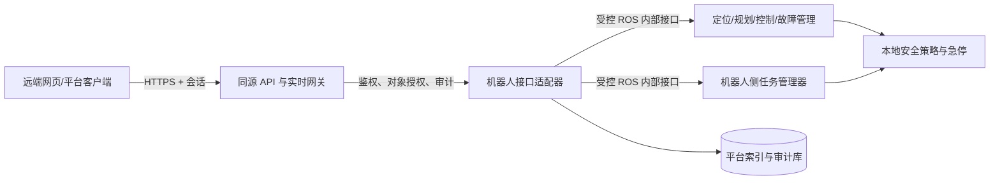

# 远端权限与平台接口设计与实施状态

状态：第一阶段已实现，仍有明确未覆盖项。本文保留设计目标，并在末尾记录当前落地范围；不能把未实现的地图/点位 API、OIDC 或所有网页写入迁移视为已完成。

## 1. 现状与必须先处理的边界

- Flask 当前只有 `AUTH_MODE=open`；请求 `local` 或 `external` 会回退到无认证的 `open`。现有 `/api/*` 包含录制、回放、设备、语音计划等读写操作，CORS 为 `*`。
- Flask 默认监听 `0.0.0.0:5050`。网页另以 `ws://<host>:9090` 直连 rosbridge，直接发布 `/goal_pose`、`/cmd_vel`、`/mission/command` 等，并调用 ROS 服务。因此仅给 Flask API 加登录无法保护机器人控制。rosbridge 的 JSON 协议允许客户端发布、订阅和调用服务，必须将它视为控制入口。[rosbridge 项目说明](https://github.com/RobotWebTools/rosbridge_suite)
- `src/extension/mission_manager` 已在机器人侧持久化任务定义、执行和事件；平台不得另建第二个任务执行器。其 `/mission/command` 使用 `request_id`，`/mission/state` 含 `task_id` 与历史，适合作为适配器的起点。
- 当前健康页从实时 ROS 数据推导状态，故障历史仅在浏览器内。平台故障需要机器人侧稳定故障码、去重和持久化，不能把每条 `/diagnostics` 原样作为新故障。

## 2. 架构与信任边界



1. **机器人侧是执行与安全权威**：任务状态、运动许可、急停和故障处置由本地节点决定。平台断线不停止已运行任务；需人工远控的连续指令在断线后停止。
2. **网关是远端唯一入口**：远端只访问同源 HTTPS API 与受保护的实时通道。`9090`、ROS DDS、相机原始端口和 Flask 内部监听只在机器人可信网络可达；防火墙/反向代理不得把原始 rosbridge 直接转给远端。
3. **所有控制从网页直连 ROS 迁至网关**：先盘点 `MapPage`、`Joystick`、`MissionClient`、`DockingControl`、`ParamsPage`、地图管理、录制回放等写入路径。远端模式下逐项改走后端命令接口；只隐藏按钮不算完成授权。网页可保留本地开发模式的直连，但不能与受保护远端部署共享公开入口。[OWASP 授权建议](https://cheatsheetseries.owasp.org/cheatsheets/Authorization_Cheat_Sheet.html)
4. **单机器人部署**：部署配置固定唯一机器人 ID；请求中的 ID 必须与该配置一致。本期不包含机器人选择或多机管理。

## 3. 身份认证模式

| 模式 | 用途 | 约束 |
|---|---|---|
| `open` | 单机开发/离线调试 | 仅绑定 loopback；需要显式开发开关；不允许作为远端部署模式。 |
| `local` | 第一阶段远端部署 | 本地用户库；首次启动创建管理员；密码使用成熟密码哈希库；服务端会话。 |
| `external` | 后续接入企业身份源 | OIDC 授权码流程；网关核验身份并映射机器人范围与角色；不直接信任客户端提交的角色头。 |

请求未实现的模式、认证配置缺失或权限存储不可用时**启动失败**，不能回退为 `open`。受保护模式使用 TLS、同源 `HttpOnly; Secure; SameSite` 会话 Cookie、CSRF 防护、会话过期与撤销；不在浏览器 `localStorage` 存凭据。[OWASP 会话建议](https://cheatsheetseries.owasp.org/cheatsheets/Session_Management_Cheat_Sheet.html)、[CSRF 建议](https://cheatsheetseries.owasp.org/cheatsheets/Cross-Site_Request_Forgery_Prevention_Cheat_Sheet.html)

`GET /api/v1/auth/me` 返回用户、每台机器人的角色及能力，用于界面显示；服务端对**每个** HTTP 请求、实时订阅和命令再次授权。禁止按浏览器传来的角色、`robot_id` 或任务所有者字段直接放行。默认拒绝未登记的路由与操作。

## 4. 角色与操作矩阵

角色按机器人授予；Admin 另有平台级用户管理权限。下表从左到右逐级包含前一级读权限，但写权限逐项明确检查。

| 操作 | Viewer | Operator | Engineer | Admin |
|---|:---:|:---:|:---:|:---:|
| 查看状态、地图、任务、故障、日志 | ✓ | ✓ | ✓ | ✓ |
| 新建任务定义、下发任务、暂停/恢复/取消/重试/跳过 |  | ✓ | ✓ | ✓ |
| 确认故障、下载普通运行日志 |  | ✓ | ✓ | ✓ |
| 地图切换、定位初始化、规划参数修改、故障清除 |  |  | ✓ | ✓ |
| 管理用户、角色、认证配置与安全策略 |  |  |  | ✓ |
| 远端手动移动 |  |  | 第二阶段，需控制租约 | 同左 |

危险操作还需服务端校验机器人状态、本地安全策略及短时二次确认。二次确认不是权限替代品。手动移动必须有独占控制租约、死手超时、速度上限与本地急停优先级；首期不开放远端手动移动。机器人拒绝操作时返回拒绝原因，不因用户是 Admin 而覆盖本地安全策略。

## 5. API v1 契约

统一前缀 `/api/v1/robots/{robot_id}`，JSON 使用 UTC ISO 8601 时间。列表支持 `limit`、`cursor`、时间范围；所有响应带 `request_id`，错误为 `{code, message, request_id, details?}`。命令请求须带 `Idempotency-Key`，重复键返回同一结果。

| 资源 | 接口 | 语义与权威数据源 |
|---|---|---|
| 机器人状态 | `GET /status`、`GET /health` | 位置、地图、定位、导航、电量、心跳及各字段 `observed_at`/`stale`；由机器人遥测汇总。 |
| 任务定义 | `GET/POST /missions`、`GET/PUT/DELETE /missions/{mission_id}` | 读写机器人侧 mission manager 的定义；修改使用版本条件。 |
| 任务执行 | `POST /tasks`、`GET /tasks`、`GET /tasks/{task_id}` | `POST` 以 `mission_id` 发起一次执行；`task_id` 标识这一次运行；历史来自机器人侧执行记录。 |
| 任务控制 | `POST /tasks/{task_id}/commands` | `pause/resume/cancel/retry/skip`；只接受当前状态允许的转换。 |
| 故障 | `GET /faults`、`GET /faults/{fault_id}`、`POST /faults/{fault_id}/ack`、`POST /faults/{fault_id}/clear` | 当前/历史、等级、码、来源、时间、恢复状态；清除需机器人侧确认。 |
| 地图与点位 | `GET /maps`、`POST /maps/{map_id}/activate`、`GET/POST /waypoints` | 地图版本、区域、点位与切换结果；切换需 Engineer。 |
| 配置 | `GET /config`、`GET /config/versions`、`PUT /config`、`POST /config/versions/{version}/activate` | 持久化草稿、校验、版本和激活结果；`If-Match` 防止覆盖并发修改。 |
| 日志 | `GET /logs`、`GET /logs/{log_id}/download` | 可按 `task_id`、`fault_code`、时间、模块过滤；下载有权限与审计。 |
| 事件流 | `GET /events` | 受保护 SSE，推送状态增量、任务事件、故障变化；断线用事件 ID 续传。 |

命令处理过程：网关鉴权和校验 → 写入审计/命令记录 → 通过 ROS 适配器发送带 `request_id` 的命令 → 等待确认 → 返回 `202 Accepted` 与 `command_id`/已知 `task_id` → 机器人状态事件给出最终结果。`202` 仅表示受理，不代表完成。机器人离线时对运动、地图切换和配置激活返回 `503`，不排队补发；任务定义草稿可明确标为“待同步”，但不能伪装成已下发。

现有 mission manager 的 `start` 确认只包含 `request_id` 和 `ok`；为稳定返回 `task_id`，需扩展确认负载或提供按 `request_id` 查询执行的接口。平台适配器不得通过“最新任务”猜测本次请求的 `task_id`。

### 示例：发起任务

```http
POST /api/v1/robots/robot-001/tasks
Idempotency-Key: 8db82d76-65af-4b77-970e-2d9f900f0248
Content-Type: application/json

{"mission_id":"patrol-a","priority":0}
```

```json
{"command_id":"cmd-01","task_id":"task-01","status":"accepted","request_id":"req-01"}
```

### 示例：状态快照

```json
{
  "robot_id":"robot-001",
  "observed_at":"2026-10-07T14:00:00Z",
  "online":true,
  "pose":{"map_id":"floor-1","x":1.2,"y":3.4,"yaw":0.5,"observed_at":"2026-10-07T13:59:59Z","stale":false},
  "navigation":{"state":"IDLE","observed_at":"2026-10-07T14:00:00Z","stale":false},
  "task":{"task_id":"task-01","mission_id":"patrol-a","status":"RUNNING"},
  "fault_counts":{"warning":0,"error":0,"fatal":0}
}
```

## 6. 持久化与审计

- **机器人侧权威库**：沿用 mission manager SQLite 的任务定义、执行和事件；增加必要的 `request_id`、命令结果及版本字段。平台索引可缓存，但重连后必须从机器人侧状态恢复，不能覆盖执行状态。
- **平台库**：用户、机器人授权范围、会话、命令审计、配置版本、规范化故障及日志元数据。单机首期可用独立 SQLite；不与任务执行库混写。
- **审计**：每次登录、权限拒绝、任务控制、手动移动、地图/配置/故障操作记录 `actor_id`、`robot_id`、动作、对象 ID、`request_id`、时间、结果和拒绝原因。日志不可由普通操作员改写。
- **故障归并**：以 `robot_id + fault_code + fault_source` 识别同一活动故障；持续异常更新 `last_seen`，恢复时记录 `resolved_at`。原始诊断可作为证据关联，不直接充当平台故障。

## 7. 实施顺序与验收

1. **封闭入口**：已完成第一阶段。`open`/`local` 可用，其他认证模式启动失败；默认 UI、rosbridge、视频服务绑定 loopback；local 模式使用 Flask 会话和受角色约束的 rosbridge 网关。远端部署必须按 `third_party/ROS2_UI/docs/security-local-mode.md` 配 HTTPS 代理及来源白名单。
2. **身份与平台只读 API**：已实现本地用户、服务端会话、机器人 ID 作用域、角色检查、状态/健康/任务/故障/日志只读 API，以及带持久事件 ID 的 SSE。Viewer 的 ROS 发布受限于少数只读请求主题。
3. **任务命令**：已实现 mission manager 适配、任务命令幂等记录、`request_id` 确认关联和 `task_id` 回传；浏览器旧页面仍可能直连 ROS，因此远端受控入口应使用新平台 API，不能认为所有旧控制流已迁移。
4. **其余写接口**：已实现任务定义/控制、平台配置版本、故障确认/清除和日志下载的角色检查。地图/点位 API、完整 ROS 参数配置、通用审计查询 API 尚未实现；旧录制回放和设备页面通过 Flask 权限表保护，但尚未全部纳入版本化平台 API。
5. **其他后续能力**：OIDC 和远端手动驾驶租约均未实现；部署固定为单机器人。

### 当前实现边界

- 本地账号由机器人端 `ui_admin` 创建；密码使用 scrypt，数据库文件设为仅运行用户可读写，会话 12 小时过期，可登出或禁用用户撤销。WebSocket 会每 30 秒重新检查会话，变更权限后需等待该检查周期或客户端断开。
- HTTP 修改请求要求 CSRF 令牌；平台写 API、HTTP 请求结果和 rosbridge 允许/拒绝的发布及服务调用写入 SQLite 审计记录。日志/审计查询 API 和保留周期配置目前未提供。
- `/events` 将状态变化写入 SQLite，支持 `Last-Event-ID` 续传，并只保留每台机器人最近 10,000 条事件。
- rosbridge 网关采用默认拒绝；`/cmd_vel` 与未登记操作关闭。只有通过 loopback 反代才能将 UI 暴露到网络，不能直接暴露 9090/9091/8080 或 ROS DDS。
- 旧 UI 仍有直接 ROS 调用路径。网关在 `local` 模式会执行 ACL，接口拒绝代表相关旧按钮无法在该模式下工作；需要逐页迁移到平台 API 才能获得完整的远端操作体验。

验收用例：Viewer 通过 HTTP、实时接口及手工连接 `9090` 都不能下发移动/任务；Operator 不能改参数或切地图；Engineer 在急停生效时也不能令车移动；两个相同幂等键只创建一次执行；平台重启或断网不重置机器人任务；任务、故障和日志均可按 `task_id` 追溯；未实现或配置错误的认证模式不能以开放模式启动。
